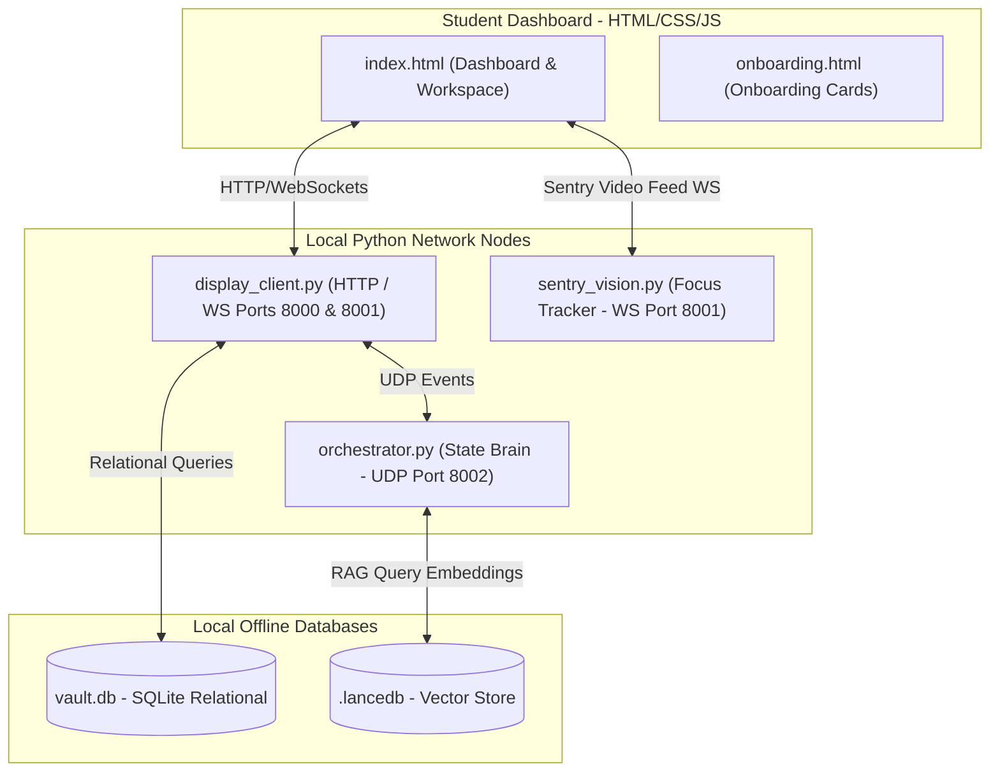
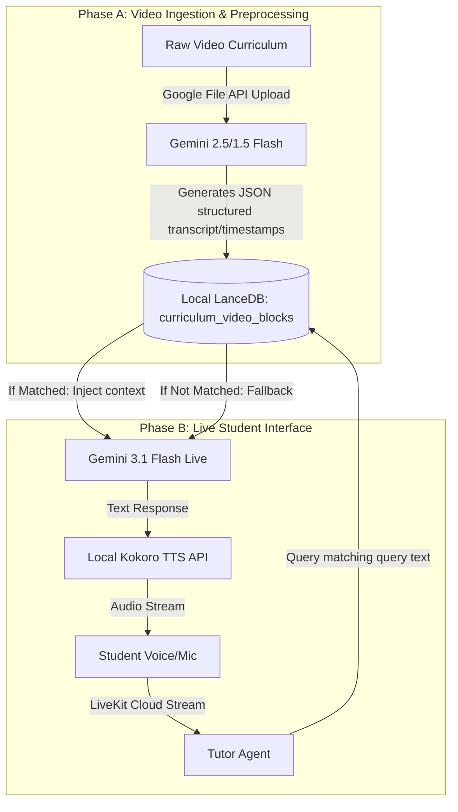

# Jetson Orin Nano Super — Headless Appliance System Context

This document captures the deep contextual knowledge, architectural decisions, database schemas, design constraints, and long-term roadmap for the platform. It serves as the single source of truth to maintain system integrity and guide future development.

---

## 🎯 1. Project Overview & Core Mission

**Ventuno Q** is a premium, localized agentic educational sandbox designed to run on physical hardware (NVIDIA Jetson Orin Nano Super) as well as desktop simulator environments.

Its ultimate goal is to provide a highly interactive, distraction-free **Midnight Academic AI** classroom. The system combines:
1. **Dynamic Curriculum Navigation**: Offline textbook/video synchronization based on a structured curriculum tree.
2. **Socratic AI Tutoring**: Grounded RAG-based chat and instant whiteboard assistance powered by Gemma 4 e4b via OpenRouter.
3. **Rigid Mastery Evaluation Gating**: A strict 85% score gateway preventing lesson progression until core concepts are mastered.
4. **Attention/Security Sentry**: Real-time 30 FPS face-tracking sentry vision (MediaPipe on Jetson GPU) to monitor student presence and focus.

---

## 🖥️ 1b. Target Hardware Stack

| Component | Hardware |
|---|---|
| **Motherboard** | NVIDIA Jetson Orin Nano Super Dev Kit |
| **Data Drive** | 512 GB M.2 2280 NVMe SSD (mounted at `/data`) |
| **OCR Camera** | Raspberry Pi Camera Module 3 Standard — CSI-0 (sensor-id=0) |
| **Webcam Camera** | Raspberry Pi Camera Module 3 Wide-Angle — CSI-1 (sensor-id=1) |
| **Cellular Link** | Waveshare 4G/5G M.2 Cellular Dongle (ModemManager / `wwan0`) |
| **eSIM Bridge** | eSIM.me Physical Adapter Card (managed via ModemManager) |
| **TTS Engine** | NVIDIA Riva / Magpie-TTS (gRPC on `localhost:50051`) |
| **GPIO Header** | 40-pin carrier board header — BOARD numbering, active-low buttons |

**GPIO Button Mapping (BOARD pin numbers):**
- Pin 15 → START
- Pin 29 → PAUSE
- Pin 31 → RAISE\_HAND

**Camera assignment:**
- `sensor-id=0` (CSI-0) → OCR Camera (Standard, document/handwriting capture)
- `sensor-id=1` (CSI-1) → Webcam (Wide-Angle, presence tracking / sentry vision)

---

## 🏗️ 2. Current Architecture & Tech Stack

The platform is designed around a modular, event-driven, three-tier architecture that runs entirely on local loops to minimize latency and bypass cloud dependencies:



### 🧩 Core Component Roles
*   **Student Workspace (`index.html` & `onboarding.html`)**: Richly-styled dark UI using HSL tailored palettes, glassmorphism, and hardware-accelerated CSS. Manages isolated container views to prevent layout bleeding.
*   **Web Server / WS Coordinator (`display_client.py`)**: Runs on port `8000` (HTTP) and `8001` (WebSockets). Handles all relational data fetches, real-time messaging, student responses grading, state updates, and Riva Magpie-TTS synthesis proxying.
*   **State Machine Brain (`orchestrator.py`)**: Receives high-priority UDP signals on port `8002`. Decides when to switch tutor modes, coordinates Jetson CUDA/TensorRT GPU inference, and serves instant localized Socratic hints during quizzes.
*   **Attention Tracker (`sentry_vision.py`)**: Monitors student focus via the wide-angle RPi Camera Module 3 (CSI-1) using MediaPipe FaceDetection (GPU) and transmits binary face-presence signals back through the WS coordinator. OCR Camera (CSI-0) is reserved for handwriting capture.
*   **Hardware Bridge (`hardware_bridge.py`)**: Listens for GPIO button interrupts on the Jetson Orin Nano 40-pin header (BOARD pin numbering). Falls back to keyboard simulation when `HARDWARE_TARGET != jetson`.

---

## 🗄️ 3. Database Schema Specifications

### A. SQLite Relational Store (`vault.db`)

*   **`user_profiles`**: Captures student onboarding credentials.
    ```sql
    CREATE TABLE user_profiles (
        user_id TEXT PRIMARY KEY,
        background_context TEXT NOT NULL
    );
    ```
*   **`mastery_ledger`**: Logs evaluation attempts, scores, and locking status.
    ```sql
    CREATE TABLE mastery_ledger (
        video_id TEXT NOT NULL,
        chapter_id TEXT NOT NULL,
        score REAL,
        mastery_achieved BOOLEAN NOT NULL CHECK (mastery_achieved IN (0, 1)),
        PRIMARY KEY (video_id, chapter_id)
    );
    ```
*   **`curriculum_tree`**: The lesson dependency nodes controlling progression.
    ```sql
    CREATE TABLE curriculum_tree (
        video_id TEXT PRIMARY KEY,
        chapter_id TEXT NOT NULL,
        title TEXT NOT NULL,
        video_file_path TEXT NOT NULL,
        pdf_file_path TEXT NOT NULL,
        unlocked BOOLEAN NOT NULL CHECK (unlocked IN (0, 1))
    );
    ```
*   **`instructors`** & **`lesson_metadata`**: Link physical lesson assets and avatars to specific teachers.
    ```sql
    CREATE TABLE instructors (
        instructor_id TEXT PRIMARY KEY,
        full_name TEXT NOT NULL,
        phone_number TEXT NOT NULL,
        experience_years INTEGER NOT NULL,
        subjects_list TEXT NOT NULL,
        profile_image TEXT NOT NULL
    );

    CREATE TABLE lesson_metadata (
        video_id TEXT PRIMARY KEY,
        chapter_id TEXT NOT NULL,
        pdf_file_path TEXT NOT NULL,
        start_page INTEGER NOT NULL,
        instructor_id TEXT,
        FOREIGN KEY (instructor_id) REFERENCES instructors(instructor_id)
    );
    ```

### B. Vector Database (`.lancedb`)
*   **`curriculum_rag`**: Stores text embeddings generated from course transcripts (`all-MiniLM-L6-v2`) used for context retrieval during chatbot conversations.

---

## 🚦 4. State of the Build

### 🟢 100% Complete Features
*   **Strict Tab Isolation**: Clear separation between `Tutor`, `Chat`, `Flashcards`, `Timestamps`, `Profile`, and `Evaluation` containers. Switching views uses absolute `display: none` to block layout duplication.
*   **Grounded Relational Routing**: `/api/lesson` dynamically maps video player paths directly from `vault.db`. Old placeholder file loops (`flower.mp4` / `sample.mp4`) have been fully stripped.
*   **Identity Mapping**: All chatbot logs dynamic names (e.g. `Professor Evans` or `Allison`) and photo avatars mapped from the database based on the active lesson.
*   **Mastery Gating Checkpoint**: Submit button grades MCQ questions. A score >= 85% logs a pass to the ledger and unlocks the next node in the curriculum tree. Scores < 85% trigger strict interlocks (disabling seeking/timeline clicks) and serve alternative module quizzes.
*   **Socratic Quiz Helper**: Mic commands during quizzes pause the timer and invoke local Socratic hints on the orchestrator, resuming playback on close.
*   **STEM Virtual Labs Suite (`antigravity_labs/web_labs_package/`)**: 100% offline interactive lab simulations for Chemistry (Acid-Base Titration with pH curves, Reaction Kinetics with Arrhenius curves, Buffer Solutions, Galvanic Cells) and Physics (Simple Pendulum, Young's Double-Slit Diffraction, 2D Projectile Motion).
*   **Omni Graph Engine (`antigravity_labs/omni_graph_engine/`)**: Dedicated high-performance computational graphing microservice on port 8085 featuring 2D/3D calculus plotting, numerical derivatives, Riemann integration partitions, parametric curves, and ODE vector fields.
*   **App Launcher Navigation Drawer**: Modern 4-tile Google-style app launcher menu organizing Dashboard, Virtual Labs, Graphs, Course Library, and Student Profile with click-outside dismissal and zero WebGL canvas teardown.
*   **Hardened Video Startup Sequence & Auto-Load**: Event-driven `initClassroomBoot()` on `DOMContentLoaded`, T=0 synchronous video buffer initialization, `/get_active_session` state sync, redundant translation bypass, and instant seek time-label restoration (`05:03 / 12:39`).

### 🟡 Partially Built / Mocked
*   **Hardware Bridge**: Physical GPIO is functional on a real Jetson (set `HARDWARE_TARGET=jetson`). Keyboard simulation is the default for development environments.
*   **Camera Neural Net**: Face tracking in `sentry_vision.py` uses MediaPipe on the Jetson GPU when `CAMERA_CAPTURE_SOURCE=csi`. Simulation mode is active by default.
*   **Riva TTS**: `display_client.py` calls the Riva Magpie-TTS gRPC server. A silent WAV mock is returned if the Riva server is not running (`TTS_BACKEND=mock`).
*   **Cellular / eSIM**: ModemManager integration is functional on Jetson JetPack. Mock simulation is active when `mmcli` is absent.

---

## 📐 5. Design & Technical Rules

1.  **Aesthetics and Transitions**: Maintain a dark academic aesthetic (charcoal gray card frames, neon-purple avatar badges, neon glowing borders). Any adjustments to the right sidebar width on desktop must follow a clean cubic-bezier transition (`width 0.3s cubic-bezier(0.16, 1, 0.3, 1)`).
2.  **No Silent Fallbacks**: If a video path or PDF file is missing, the system must throw an explicit exception and log missing parameters rather than falling back to placeholder strings.
3.  **Quiz Isolation**: Quizzes must bypass RAG embedding lookups to prevent CPU/NPU latency. Socratic hints are looked up locally in python dictionaries on the orchestrator.
4.  **Device Lock State**: Once a lesson is locked due to an evaluation fail, seek operations and sidebar switches away from `#evaluation-pane` must block and display warning toasts until a passing score is recorded.

---

## 🗺️ 6. Future Roadmap

1.  **GPIO Indicators**: Add LED feedback (focus alerts) and relay control (screen lock) via the Jetson 40-pin header.
2.  **Gaze & Attention Depth**: Upgrade `sentry_vision.py` from binary face presence to full gaze-landmark tracking (MediaPipe FaceMesh) to detect look-away and drowsiness states.
3.  **Riva Magpie-TTS Multilingual Expansion**: Deploy additional Riva voice models for `pt_PT` and `ar_AE` locales to complete all six supported languages with neural TTS voices.
4.  **NVMe Curriculum Storage**: Move all `curriculum_staging/` content to the `/data` NVMe mount to leverage the 512 GB SSD for large video libraries.
5.  **Collaborative Study Mode**: Networked classrooms enabling student peer interactions over localized WebSocket tunnels.
6.  **eSIM Cloud Bursting Hardening**: Replace mock cellular signal with real ModemManager data connection health monitoring tied to the eSIM.me adapter profile.

---

## ☁️ 7. Hybrid Architecture & Online Prototype Phase

To dry-run and test the system before deploying it to physical Jetson/Arduino hardware, a **hybrid online prototype** is established using cloud APIs for heavy lift tasks and local databases for context.

### A. Pipeline Workflow



1.  **Ingestion & Preprocessing**:
    *   Curriculum videos are uploaded to Google File Storage via the `google-genai` SDK.
    *   `gemini-2.5-flash` processes the video and returns a structured JSON array detailing each conceptual segment (timestamp `HH:MM:SS`, title, transcript_summary, keywords).
    *   This data is stored locally in an embedded LanceDB database (`curriculum_video_blocks` table).
2.  **Live Interaction**:
    *   A student connects via WebRTC to a LiveKit Cloud room.
    *   The Python `tutor_agent` receives the student's transcribed query and checks LanceDB.
    *   If a context match is found, the agent injects the specific segment context into the system prompt for `gemini-3.1-flash-live`.
    *   If no match is found, the agent lets the query pass to `gemini-3.1-flash-live` using its global knowledge base.
    *   Text output is piped to a local `Kokoro TTS` server (OpenAI-compatible) for voice output back to the student.

### B. Environment & API Key Prerequisites

To run Phase A and B, the system requires:
*   `GOOGLE_API_KEY`: For Gemini model access and Google STT during cloud testing.
*   `LIVEKIT_URL`: WebRTC room endpoint (e.g. `wss://your-project.livekit.cloud`).
*   `LIVEKIT_API_KEY` & `LIVEKIT_API_SECRET`: Authenticating the agent with the LiveKit Cloud room.
*   `Kokoro-FastAPI` endpoint running locally at `http://localhost:8880/v1`.

---

## ☁️ 8. Socratic Voice Agent Debugging & Connection Hardening

To maintain the WebRTC audio chat stability and prevent connection dropouts, adhere to the following rules:

### A. Gemini Multimodal Live Model
*   **Target Model**: Always use `"gemini-3.1-flash-live-preview"` inside `RealtimeModel`. Other model names (like `gemini-2.0-flash-exp` or `gemini-2.5-flash-live`) will fail during handshake with a `1008 policy violation` or hang silently.

### B. Python Scoping & Indentation
*   All helper functions inside `tutor_agent.py` (such as `translate_via_gemini`, `search_curriculum`, and event listeners like `on_room_disconnected`) **must remain indented by 4 spaces** inside `async def entrypoint(ctx: JobContext):`. 
*   If any helper is written at column 0, it prematurely terminates `entrypoint` scope. Python will treat the rest of the file as nested inside the helper, preventing `entrypoint` from ever starting the `AgentSession` or registering listeners.

### C. Persistent Local Development Workers
*   Do **NOT** call `os._exit(1)` inside client event handlers (`disconnected`, `close`). 
*   In local development, calling `os._exit(1)` terminates the Python runner process when a user reloads their page or changes tabs. Keep the worker process alive so it automatically picks up new WebRTC sessions upon browser refresh or tab switching.

### D. Browser Audio & Microphone Controls
*   To publish the student's microphone stream in `index.html`, always call:
    `await lkRoom.localParticipant.setMicrophoneEnabled(true);`
*   Avoid hallucinated client SDK methods like `enableCameraAndMicrophone`, which throw silent TypeError exceptions and block the WebRTC audio track from publishing.
