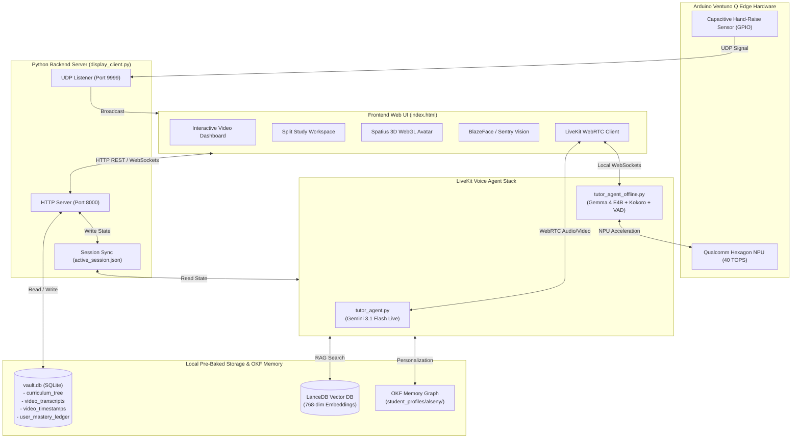

# 📚 Ventuno AI — Socratic Tutor System Architecture & Technical Manual

> **System Name**: Ventuno AI Socratic Tutor (Codename: **GANDHO**)  
> **Target Platform**: Arduino Ventuno Q Edge Hardware & Web Ecosystem  
> **Core Architecture**: Dual-Engine (Online Gemini 3.1 Live WebRTC + 100% Offline Local Gemma 4 NPU / Hugging Face S2S Framework) + Hybrid RAG (Retrieval-Augmented Generation)  
> **Pedagogical Philosophy**: Socratic Guidance (Guiding students through critical questioning rather than direct answer dumps)

---

## 📋 Table of Contents

1. [Executive Summary & Core Objectives](#1-executive-summary--core-objectives)
2. [Target Hardware Specifications (Arduino Ventuno Q)](#2-target-hardware-specifications-arduino-ventuno-q)
3. [Software & Technology Stack](#3-software--technology-stack)
4. [System Architecture & Flow Diagrams](#4-system-architecture--flow-diagrams)
5. [Database Schemas & Data Storage](#5-database-schemas--data-storage)
6. [Detailed Feature & Subsystem Breakdown](#6-detailed-feature--subsystem-breakdown)
   - [6.1 Dual-Mode Socratic Voice Agent (GANDHO: Online & Offline)](#61-dual-mode-socratic-voice-agent-gandho-online--offline)
   - [6.2 Hugging Face Speech-to-Speech (S2S) Offline Framework & Gemma 4 NPU Acceleration](#62-hugging-face-speech-to-speech-s2s-offline-framework--gemma-4-npu-acceleration)
   - [6.3 Video Player & Hardened Synced Textbook Drawer](#63-video-player--hardened-synced-textbook-drawer)
   - [6.4 Split Study Workspace & Spatius 3D Avatar Engine](#64-split-study-workspace--spatius-3d-avatar-engine)
   - [6.5 Document Picture-in-Picture (PiP) & Docking](#65-document-picture-in-picture-pip--docking)
   - [6.6 Sentry Vision & Presence Detection](#66-sentry-vision--presence-detection)
   - [6.7 Live Screen Sharing, 1 FPS Vision Rate-Limiting & Desktop Multimodal Vision](#67-live-screen-sharing-1-fps-vision-rate-limiting--desktop-multimodal-vision)
   - [6.8 Evaluation & Mastery Quiz Engine](#68-evaluation--mastery-quiz-engine)
   - [6.9 Revision & Course Library with Batch Pagination](#69-revision--course-library-with-batch-pagination)
   - [6.10 Universal Subject Switching & Progression Persistence](#610-universal-subject-switching--progression-persistence)
7. [Offline Pre-Processing & Device Ingestion Pipeline](#7-offline-pre-processing--device-ingestion-pipeline)
8. [Setup, Execution & Maintenance Commands](#8-setup-execution--maintenance-commands)

---

## 1. Executive Summary & Core Objectives

The **Ventuno AI Socratic Tutor System** is a state-of-the-art educational platform designed to empower K-12 and higher-education students through personalized, interactive Socratic learning. Named **GANDHO** (the Socratic Tutor), the AI system acts as a personal mentor, asking probing questions, offering step-by-step hints, evaluating mastery through 85%+ gated assessments, and observing the student's work via camera and screen sharing.

### Key Innovations:
- **Dual-Engine Voice Agent**:
  - **Online Mode**: High-fidelity multimodal streaming using `gemini-3.1-flash-live-preview` via LiveKit WebRTC.
  - **Offline Mode**: 100% local, low-latency, full-duplex voice agent using Hugging Face S2S principles, Silero VAD micro-chunking, local Gemma 4 E4B on the Qualcomm Hexagon NPU, and local Kokoro-82M TTS.
- **OKF Student Memory Graph (`student_memory.py`)**: Persistent, model-agnostic student personalization reading/writing Markdown profile graphs (`subject_*.md`, `session_state.md`) in `student_profiles/`.
- **Interactive 3D WebGL Avatar**: Lip-synced 3D character powered by the Spatius WebGL engine.
- **Gated Progression**: Students must pass 85%+ evaluation assessments before unlocking subsequent lessons in a subject track.

---

## 2. Target Hardware Specifications (Arduino Ventuno Q)

The production system targets the **Arduino Ventuno Q** edge AI compute board with integrated hardware peripherals:

| Component | Hardware Specification & Integration Details |
| :--- | :--- |
| **Compute Processor** | Snapdragon SoC with onboard Qualcomm Hexagon NPU (40 TOPS) for local Gemma 4 E4B inference via LiteRT / QNN. |
| **Memory Headroom** | 16GB LPDDR5 RAM (~5GB allocated for Gemma 4 + Kokoro TTS + Silero VAD + LanceDB, leaving 10+ GB free). |
| **Storage** | 128GB / 256GB NVMe or Ultra-Fast MicroSD containing pre-baked `vault.db`, LanceDB vectors, and media files. |
| **Hand-Raise Sensor** | Capacitive Hand-Raise Touch Sensor (`hardware_bridge.py` monitoring `CAPACITIVE_HAND_RAISE_GPIO_PIN`). |
| **Vision Camera** | Sentry Vision Desk Camera (`sentry_vision_desk_01`) for observing paper scratchpads and student presence. |
| **Audio I/O** | High-sensitivity MEMS microphone array and stereo speakers for WebRTC voice interaction. |

---

## 3. Software & Technology Stack

### **Frontend**:
- **Core Technology**: HTML5, Vanilla JavaScript (ES6+), Vanilla CSS Token System (Glassmorphism & Neon Dark Palette).
- **Typography & Math Rendering**: Google Fonts (`Outfit`, `Geist`), KaTeX LaTeX Math Engine.
- **Document & PDF Viewer**: PDF.js for synced textbook drawer rendering.
- **3D Avatar Engine**: Spatius 3D WebGL Manager (`window.spatiusAvatarManager`).
- **Webcam & Vision**: TensorFlow.js BlazeFace model for local face presence detection.
- **Real-Time Communication**: LiveKit WebRTC Client SDK (`livekit-client`).

### **Backend Server (`display_client.py`)**:
- **Framework**: Python 3.14+ web server running on `http://127.0.0.1:8000`.
- **Session Synchronization**: Writes and syncs active lesson state to absolute path `c:/Users/lalyb/Desktop/ventuno_ai_testbed/active_session.json`.
- **Telemetry Bridge**: UDP Socket Receiver on port `9999` for hardware hand-raise signals.
- **AI Orchestration**: `orchestrator.py` & `qwen_omni_client.py` for local LLM health checks and fallback hint generation.

### **LiveKit Voice Agent Stack (`livekit_stack/agent/`)**:
- **Online Agent (`tutor_agent.py`)**: `gemini-3.1-flash-live-preview` via `livekit.plugins.google.realtime` (`mutable = True` hotpatch applied).
- **Offline Agent (`tutor_agent_offline.py`)**: `FasterWhisperSTT` (local INT8 Whisper) + `SileroVAD` + OpenAI-compatible local LLM endpoint (`http://localhost:8080/v1` for Gemma 4) + `Kokoro-82M` local TTS.
- **Watcher (`run_agent.py`)**: Auto-restart wrapper supporting `--offline` flag to toggle agent modes.

---

## 4. System Architecture & Flow Diagrams

### **Overall System Flow Diagram**:



---

## 5. Database Schemas & Data Storage

The system relies on **SQLite (`vault.db`)** for relational metadata, **LanceDB** for vector embeddings, and **OKF Markdown Files** for student personalization.

### **SQLite Tables (`vault.db`)**:

1. `curriculum_tree`:
   - `video_id` (TEXT PRIMARY KEY)
   - `subject` (TEXT) — e.g. `Economics`, `Chemistry`, `Philosophy`, `Physics`, `Mathematics`
   - `chapter_id` (TEXT)
   - `title` (TEXT)
   - `video_path` (TEXT)
   - `pdf_path` (TEXT)

2. `video_transcripts`:
   - `video_id` (TEXT)
   - `timestamp` (TEXT) — e.g. `[02:17]`
   - `text` (TEXT) — French transcript segment
   - `translated_text` (TEXT) — English translation

3. `video_timestamps`:
   - `video_id` (TEXT)
   - `time_seconds` (INTEGER)
   - `topic_title` (TEXT)
   - `summary` (TEXT)

4. `user_mastery_ledger`:
   - `user_name` (TEXT)
   - `video_id` (TEXT)
   - `chapter_id` (TEXT)
   - `score` (REAL) — Percentage score achieved on assessment
   - `mastery_achieved` (INTEGER) — `1` if score $\ge 85.0\%$, else `0`

---

## 6. Detailed Feature & Subsystem Breakdown

### 6.1 Dual-Mode Socratic Voice Agent (GANDHO: Online & Offline)
- **Identity**: GANDHO, an empathetic, highly knowledgeable Socratic Tutor.
- **Personalization via OKF**: Greets the student by name (**Alseny**) and reads student memory profiles from `student_memory.py` (`subject_*.md`, `session_state.md`).
- **Socratic Method**: Never gives away direct answers. Asks guiding questions, breaks down problems step-by-step, and encourages critical thinking.

### 6.2 Hugging Face Speech-to-Speech (S2S) Offline Framework & Gemma 4 NPU Acceleration
- **Framework Integration**: Built upon Hugging Face S2S architecture principles for real-time full-duplex voice interaction.
- **Barge-In (Interruption)**: Silero VAD micro-chunk listening continuously monitors input audio. Detecting human speech instantly flushes the playout buffer and halts ongoing LLM generation.
- **NPU Execution**: Offloads quantized Gemma 4 E4B to the Qualcomm Hexagon NPU (40 TOPS), leaving CPU memory and compute free for Kokoro TTS and LanceDB vector search.

### 6.3 Video Player & Hardened Synced Textbook Drawer
- **Video Playback**: Custom video player with timeline synchronization.
- **Hardened Textbook Drawer (`📖`)**: Clicking the Book Icon on the video player or header calls `toggleTextbook(true)`, which **hardens and re-syncs** the drawer PDF to the exact textbook of the currently playing lecture video, even if a custom book (e.g. Baltasar Gracián) was opened inside the drawer earlier.

### 6.4 Split Study Workspace & Spatius 3D Avatar Engine
- **Workspace Access**: Clicking **`[📚 Espaces d'Étude]`** opens a side-by-side study environment featuring the 3D avatar on the left and a dual PDF/Whiteboard pane on the right.
- **WebGL Context Preservation**: Whenever `#avatarImgBox` is reparented in the DOM tree, `window.spatiusAvatarManager.stopAvatar()` is called, followed by `startAvatar()` to rebuild the WebGL canvas without context loss.

### 6.5 Document Picture-in-Picture (PiP) & Docking
- **Popout Button (`🗗 Popout`)**: Detaches `#avatarImgBox` into a floating, always-on-top OS window via Browser Document PiP API.
- **Docking (`↙ Dock`)**: Re-anchors the avatar DOM node back into `#socraticWorkspaceAvatarPanel`.

### 6.6 Sentry Vision & Presence Detection
- **Presence Sentry**: Detects face presence to auto-pause lecture video when the student steps away and resume when they return (unless textbook drawer or split workspace is open).

### 6.7 Live Screen Sharing, 1 FPS Vision Rate-Limiting & Desktop Multimodal Vision
- **Screen Share Button (`🖥️ Screen Share`)**: Allows sharing Entire Screen / Desktop.
- **1 FPS Vision Throttling**: Frame forwarding in `tutor_agent.py` (`forward_video()`) is rate-limited to 1 frame per second to prevent Realtime API vision buffer overflow and hallucinations.
- **Strict Vision Prompting**: Instructs GANDHO to read and discuss ONLY the exact title, text, and visual content displayed on the shared screen (e.g., Plato's *The Republic*), forbidding default topic hallucinations.

### 6.8 Evaluation & Mastery Quiz Engine
- **85%+ Threshold**: Students must achieve $\ge 85\%$ on the evaluation test to mark the video as **`VALIDÉ (85%+)`** and unlock subsequent curriculum lessons.
- **Practice Quiz Mode**: Unlocks expanded 30-question practice mode after achieving 85%+ mastery.

### 6.9 Revision & Course Library with Batch Pagination
- **Tab (`Révision & Cours`)**: Overview library of all curriculum lessons across subjects.
- **Batch Pagination**: Displays 4 video cards at a time with `▼ Voir Plus` loading.

### 6.10 Universal Subject Switching & Progression Persistence
- **Universal Restoration**: `bootActiveSessionVideo()` checks `lastActiveVideoId` and subject-specific bookmarks (`lastActiveVideo_<Subject>`) across Economics, Chemistry, Physics, Philosophy, and Mathematics.
- **Flicker-Free Boot**: Initial track setup checks `localStorage` during initial script execution, eliminating any title flicker on page refresh.

---

## 7. Offline Pre-Processing & Device Ingestion Pipeline

```
[Raw MP4 Video & PDF Files] 
       ↓
[ingest_curriculum.py / preprocess_curriculum.py]
       ↓ (Extract Transcripts, Vector Embeddings & Socratic Matrices via Gemini/Qwen)
[vault.db (SQLite) & LanceDB Vector Store]
       ↓ (Pre-bake database & media onto device image)
[Arduino Ventuno Q NVMe / MicroSD Storage]
       ↓
[Instant 100% Offline Socratic Tutor Device]
```

---

## 8. Setup, Execution & Maintenance Commands

### **Start Backend Server**:
```bash
python display_client.py
```

### **Start LiveKit Voice Agent (Online Mode - Gemini 3.1 Flash Live)**:
```bash
python livekit_stack/agent/run_agent.py start
# or in dev mode:
python livekit_stack/agent/run_agent.py dev
```

### **Start LiveKit Voice Agent (Offline Mode - Local Gemma 4 NPU + Kokoro)**:
```bash
python livekit_stack/agent/run_agent.py --offline start
# or in dev mode:
python livekit_stack/agent/run_agent.py --offline dev
```

### **Check Active Session State API**:
```bash
python -c "import urllib.request; print(urllib.request.urlopen('http://127.0.0.1:8000/get_active_session').read().decode())"
```

---
*Documentation maintained by Ventuno AI Engineering Team.*
