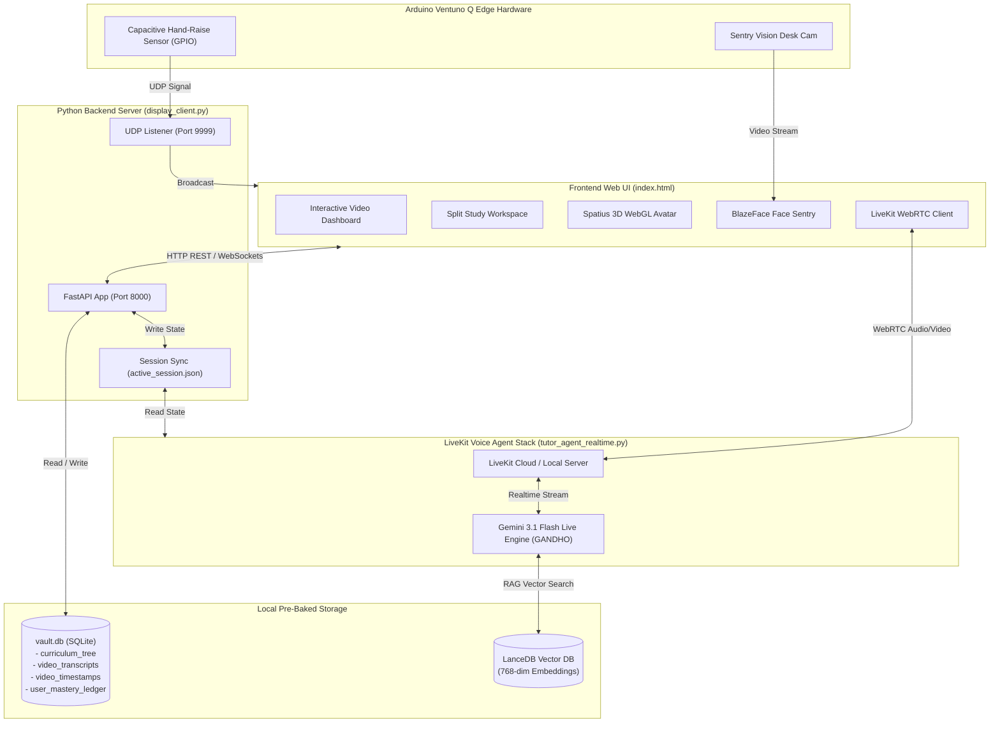

# 📚 Ventuno AI — Socratic Tutor System Architecture & Technical Manual

> **System Name**: Ventuno AI Socratic Tutor (Codename: **GANDHO**)  
> **Target Platform**: Arduino Ventuno Q Edge Hardware & Web Ecosystem  
> **Core Architecture**: Offline-First Hybrid RAG (Retrieval-Augmented Generation) + LiveKit Realtime Multimodal AI Voice & Vision Engine  
> **Pedagogical Philosophy**: Socratic Guidance (Guiding students through critical questioning rather than direct answer dumps)

---

## 📋 Table of Contents

1. [Executive Summary & Core Objectives](#1-executive-summary--core-objectives)
2. [Target Hardware Specifications (Arduino Ventuno Q)](#2-target-hardware-specifications-arduino-ventuno-q)
3. [Software & Technology Stack](#3-software--technology-stack)
4. [System Architecture & Flow Diagrams](#4-system-architecture--flow-diagrams)
5. [Database Schemas & Data Storage](#5-database-schemas--data-storage)
6. [Detailed Feature & Subsystem Breakdown](#6-detailed-feature--subsystem-breakdown)
   - [6.1 Socratic Voice Agent (GANDHO)](#61-socratic-voice-agent-gandho)
   - [6.2 Video Player & Synced Textbook Drawer](#62-video-player--synced-textbook-drawer)
   - [6.3 Split Study Workspace & Spatius 3D Avatar Engine](#63-split-study-workspace--spatius-3d-avatar-engine)
   - [6.4 Document Picture-in-Picture (PiP) & Docking](#64-document-picture-in-picture-pip--docking)
   - [6.5 Sentry Vision & Presence Detection](#65-sentry-vision--presence-detection)
   - [6.6 Live Screen Sharing & Desktop Multimodal Vision](#66-live-screen-sharing--desktop-multimodal-vision)
   - [6.7 Evaluation & Mastery Quiz Engine](#67-evaluation--mastery-quiz-engine)
   - [6.8 Revision & Course Library with Batch Pagination](#68-revision--course-library-with-batch-pagination)
   - [6.9 Subject Switching & Progression Persistence](#69-subject-switching--progression-persistence)
7. [Offline Pre-Processing & Device Ingestion Pipeline](#7-offline-pre-processing--device-ingestion-pipeline)
8. [Setup, Execution & Maintenance Commands](#8-setup-execution--maintenance-commands)

---

## 1. Executive Summary & Core Objectives

The **Ventuno AI Socratic Tutor System** is a state-of-the-art educational platform designed to empower K-12 and higher-education students through personalized, interactive Socratic learning. Named **GANDHO** (the Socratic Tutor), the AI system acts as a personal mentor, asking probing questions, offering step-by-step hints, evaluating mastery through 85%+ gated assessments, and observing the student's work via camera and screen sharing.

### Key Innovations:
- **Offline-First Design**: The entire curriculum (videos, textbooks, transcripts, vector embeddings, and quiz matrices) is pre-processed using Gemini/Qwen LLMs and stored locally on the device, eliminating internet lag and network dependency.
- **Multimodal Socratic Voice Agent**: Live voice conversation utilizing `gemini-3.1-flash-live-preview` via LiveKit WebRTC.
- **Interactive 3D WebGL Avatar**: Lip-synced 3D character powered by the Spatius WebGL engine.
- **Gated Progression**: Students must pass 85%+ evaluation assessments before unlocking subsequent lessons in a subject track.

---

## 2. Target Hardware Specifications (Arduino Ventuno Q)

The production system targets the **Arduino Ventuno Q** edge AI compute board with integrated hardware peripherals:

| Component | Hardware Specification & Integration Details |
| :--- | :--- |
| **Compute Processor** | High-performance SoC with onboard Neural Processing Unit (NPU) for local AI inference. |
| **Storage** | 128GB / 256GB NVMe or Ultra-Fast MicroSD containing pre-baked `vault.db`, LanceDB vectors, and media files. |
| **Hand-Raise Sensor** | Capacitive Hand-Raise Touch Sensor (`hardware_bridge.py` monitoring `CAPACITIVE_HAND_RAISE_GPIO_PIN`). |
| **Vision Camera** | Sentry Vision Desk Camera (`sentry_vision_desk_01`) for observing paper scratchpads and student presence. |
| **Audio I/O** | High-sensitivity MEMS microphone array and stereo speakers for LiveKit WebRTC voice interaction. |
| **Display Output** | Dual-display / high-resolution touch display for the main UI dashboard and split workspace. |

---

## 3. Software & Technology Stack

### **Frontend**:
- **Core Technology**: HTML5, Vanilla JavaScript (ES6+), Vanilla CSS Token System (Glassmorphism & Neon Dark Palette).
- **Typography & Math Rendering**: Google Fonts (`Outfit`, `Geist`), KaTeX LaTeX Math Engine.
- **Document & PDF Viewer**: PDF.js for synced textbook drawer rendering.
- **3D Avatar Engine**: Spatius 3D WebGL Manager (`window.spatiusAvatarManager`).
- **Webcam & Vision**: TensorFlow.js BlazeFace model for local face presence detection.
- **Real-Time Communication**: LiveKit WebRTC Client SDK (`livekit-client`).

### **Backend Server (`display_client.py`)**:
- **Framework**: Python 3.14+ FastAPI & Uvicorn web server running on `http://127.0.0.1:8000`.
- **Session Synchronization**: Writes and syncs active lesson state to absolute path `c:/Users/lalyb/Desktop/ventuno_ai_testbed/active_session.json`.
- **Telemetry Bridge**: UDP Socket Receiver on port `9999` for hardware hand-raise signals.
- **AI Orchestration**: `orchestrator.py` & `qwen_omni_client.py` for fallback Socratic hint generation.

### **LiveKit Voice Agent (`livekit_stack/agent/`)**:
- **Model**: `gemini-3.1-flash-live-preview` via `livekit.plugins.google.realtime`.
- **LiveKit Hotpatch**: `mutable = True` hotpatch applied at line 296 of `realtime_api.py` in site-packages.
- **Track Subscription**: Configured with `AutoSubscribe.SUBSCRIBE_ALL` to receive both audio and screen share video tracks.

---

## 4. System Architecture & Flow Diagrams

### **Overall System Flow Diagram**:



---

## 5. Database Schemas & Data Storage

The system relies on **SQLite (`vault.db`)** for relational metadata and **LanceDB** for vector embeddings.

### **SQLite Tables (`vault.db`)**:

1. `curriculum_tree`:
   - `video_id` (TEXT PRIMARY KEY)
   - `subject` (TEXT) — e.g. `Economics`, `Chemistry`, `Philosophy`, `Physics`
   - `chapter_id` (TEXT)
   - `title` (TEXT)
   - `video_path` (TEXT)
   - `pdf_path` (TEXT)

2. `video_transcripts`:
   - `video_id` (TEXT)
   - `timestamp` (TEXT) — e.g. `[02:17]`
   - `text` (TEXT) — French transcript segment
   - `translated_text` (TEXT) — English translation

3. `video_timestamps`:
   - `video_id` (TEXT)
   - `time_seconds` (INTEGER)
   - `topic_title` (TEXT)
   - `summary` (TEXT)

4. `user_mastery_ledger`:
   - `user_name` (TEXT)
   - `video_id` (TEXT)
   - `chapter_id` (TEXT)
   - `score` (REAL) — Percentage score achieved on assessment
   - `mastery_achieved` (INTEGER) — `1` if score $\ge 85.0\%$, else `0`

---

## 6. Detailed Feature & Subsystem Breakdown

### 6.1 Socratic Voice Agent (GANDHO)
- **Identity**: GANDHO, an empathetic, highly knowledgeable Socratic Tutor.
- **Personalization**: Greets the student by name (**Alseny**) and reads student memory profiles from `student_memory.py` (OKF memory framework).
- **Socratic Method**: Never gives away direct answers immediately. Asks guiding questions, breaks down math/science problems step-by-step, and encourages critical thinking.

### 6.2 Video Player & Synced Textbook Drawer
- **Video Playback**: Renders lecture videos with custom controls.
- **Synced Textbook Drawer (`📖`)**: Clicking the book icon slides out the textbook PDF viewer (`workspacePdfIframe`) loaded with the exact PDF corresponding to the current video lesson.
- **Auto-Pause & State Locking**: Opening the textbook drawer sets `window.isTextbookDrawerOpen = true`, pausing the video.

### 6.3 Split Study Workspace & Spatius 3D Avatar Engine
- **Workspace Access**: Clicking **`[📚 Espaces d'Étude]`** opens a side-by-side study environment featuring the 3D avatar on the left and a dual PDF/Whiteboard pane on the right.
- **WebGL Context Preservation**: Whenever `#avatarImgBox` is reparented in the DOM tree, `window.spatiusAvatarManager.stopAvatar()` is called, followed by `startAvatar()` to rebuild the WebGL canvas without context loss.
- **`[🚪 Return to Video]`**: Exiting the split workspace clears workspace locks and automatically resumes video playback seamlessly.

### 6.4 Document Picture-in-Picture (PiP) & Docking
- **Popout Button (`🗗 Popout`)**: Utilizes the modern Browser Document Picture-in-Picture API to detach `#avatarImgBox` into a floating, always-on-top OS window.
- **Docking (`↙ Dock`)**: Re-adopts the DOM node into the main document and re-anchors it back into `#socraticWorkspaceAvatarPanel`.

### 6.5 Sentry Vision & Presence Detection
- **BlazeFace Detector**: Runs a continuous loop checking for the student's face.
- **State Locks**: If the student steps away, Sentry Vision pauses the video. When the student returns, Sentry Vision resumes the video **unless** the textbook drawer or split workspace is active (`window.isTextbookDrawerOpen` or `window.isWorkspaceActive`).

### 6.6 Live Screen Sharing & Desktop Multimodal Vision
- **Screen Share Button (`🖥️ Screen Share`)**: Allows the student to share their Entire Screen / Desktop.
- **Multimodal Stream**: The screen share video track is published to LiveKit, where GANDHO inspects the desktop screen in real-time to assist with external books, code, or homework documents.

### 6.7 Evaluation & Mastery Quiz Engine
- **85%+ Threshold**: Students must achieve $\ge 85\%$ on the 3-question evaluation test to mark the video as **`VALIDÉ (85%+)`** and unlock subsequent curriculum lessons.
- **Extra Practice Button (`PLUS DE QUESTIONS D'ENTRAÎNEMENT`)**: Completely hidden/locked until the active video achieves 85%+ mastery. Once passed, unlocks an expanded 30-question practice mode.

### 6.8 Revision & Course Library with Batch Pagination
- **Tab (`Révision & Cours`)**: Overview library of all curriculum lessons across subjects.
- **Batch Pagination**: Displays 4 video cards at a time.
- **"Voir Plus" / "See More" Button**: Clicking `▼ Voir Plus (+4 leçons restantes)` dynamically loads and renders the next batch of 4 lessons.
- **Subject Filtering**: Instant filtering by subject tabs (`Tous les sujets`, `Économie`, `Chimie`, `Philosophie`, `Physique`).

### 6.9 Subject Switching & Progression Persistence
- **State Persistence**: The system maintains per-subject active video state in `localStorage` under `lastActiveVideo_<subject>` (e.g. `lastActiveVideo_Economics`).
- **Subject Transition**: Switching from Economics to Chemistry and back to Economics preserves the student's latest unlocked lesson (`02_Les problèmes sanitaires`) instead of defaulting back to lesson 01.

---

## 7. Offline Pre-Processing & Device Ingestion Pipeline

Before distributing an Arduino Ventuno Q device to a student, the entire curriculum is pre-processed offline:

```
[Raw MP4 Video & PDF Files] 
       ↓
[ingest_curriculum.py / preprocess_curriculum.py]
       ↓ (Extract Transcripts, Vector Embeddings & Socratic Matrices via Gemini/Qwen)
[vault.db (SQLite) & LanceDB Vector Store]
       ↓ (Pre-bake database & media onto device image)
[Arduino Ventuno Q NVMe / MicroSD Storage]
       ↓
[Instant 100% Offline Socratic Tutor Device]
```

---

## 8. Setup, Execution & Maintenance Commands

### **Start Backend Server**:
```bash
python display_client.py
```

### **Start LiveKit Voice Agent (Realtime Mode)**:
```bash
python livekit_stack/agent/tutor_agent_realtime.py dev
```

### **Check Active Session State API**:
```bash
python -c "import urllib.request; print(urllib.request.urlopen('http://127.0.0.1:8000/get_active_session').read().decode())"
```

---
*Documentation maintained by Ventuno AI Engineering Team.*
