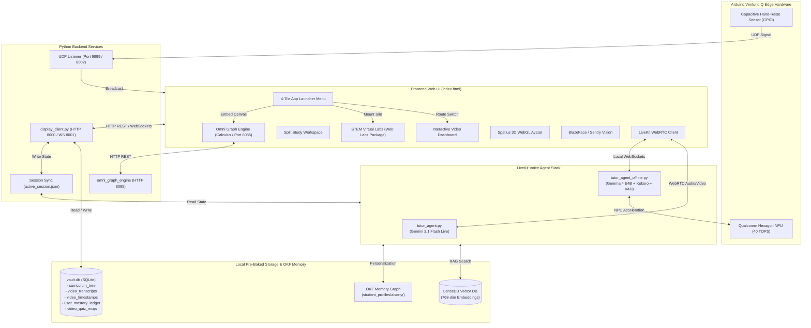

# 📚 Ventuno AI — Socratic Tutor System Architecture & Technical Manual

> **System Name**: Ventuno AI Socratic Tutor (Codename: **GANDHO**)  
> **Target Platform**: Arduino Ventuno Q Edge Hardware & Web Ecosystem  
> **Core Architecture**: Dual-Engine (Online Gemini 3.1 Live WebRTC + 100% Offline Local Gemma 4 NPU / Hugging Face S2S Framework) + Hybrid RAG (Retrieval-Augmented Generation)  
> **Pedagogical Philosophy**: Socratic Guidance (Guiding students through critical questioning rather than direct answer dumps)

---

## 📋 Table of Contents

1. [Executive Summary & Core Objectives](#1-executive-summary--core-objectives)
2. [Target Hardware Specifications (Arduino Ventuno Q)](#2-target-hardware-specifications-arduino-ventuno-q)
3. [Software & Technology Stack](#3-software--technology-stack)
4. [System Architecture & Flow Diagrams](#4-system-architecture--flow-diagrams)
5. [Database Schemas & Data Storage](#5-database-schemas--data-storage)
6. [Detailed Feature & Subsystem Breakdown](#6-detailed-feature--subsystem-breakdown)
   - [6.1 Dual-Mode Socratic Voice Agent (GANDHO: Online & Offline)](#61-dual-mode-socratic-voice-agent-gandho-online--offline)
   - [6.2 Hugging Face Speech-to-Speech (S2S) Offline Framework & Gemma 4 NPU Acceleration](#62-hugging-face-speech-to-speech-s2s-offline-framework--gemma-4-npu-acceleration)
   - [6.3 Video Player & Hardened Synced Textbook Drawer](#63-video-player--hardened-synced-textbook-drawer)
   - [6.4 Split Study Workspace & Spatius 3D Avatar Engine](#64-split-study-workspace--spatius-3d-avatar-engine)
   - [6.5 Document Picture-in-Picture (PiP) & Docking](#65-document-picture-in-picture-pip--docking)
   - [6.6 Sentry Vision & Presence Detection](#66-sentry-vision--presence-detection)
   - [6.7 Live Screen Sharing, 1 FPS Vision Rate-Limiting & Desktop Multimodal Vision](#67-live-screen-sharing-1-fps-vision-rate-limiting--desktop-multimodal-vision)
   - [6.8 Evaluation & Mastery Quiz Engine](#68-evaluation--mastery-quiz-engine)
   - [6.9 Revision & Course Library with Batch Pagination](#69-revision--course-library-with-batch-pagination)
   - [6.10 Universal Subject Switching & Progression Persistence](#610-universal-subject-switching--progression-persistence)
   - [6.11 Historical Savants & Interdisciplinary Connections Matrix](#611-historical-savants--interdisciplinary-connections-matrix-savant_curriculum_matrixpy)
   - [6.12 STEM Virtual Labs Suite (Chemistry & Physics Simulations)](#612-stem-virtual-labs-suite-antigravity_labsweb_labs_package)
   - [6.13 Omni Graph Engine (Calculus & Mathematical Function Grapher)](#613-omni-graph-engine-calculus--mathematical-function-grapher---port-8085)
   - [6.14 App Launcher Menu & Streamlined Top Navigation](#614-app-launcher-menu--streamlined-top-navigation)
   - [6.15 Hardened Video Startup Sequence & Performance Architecture](#615-hardened-video-startup-sequence--performance-architecture)
   - [6.16 Voice Agent "Lab Telekinesis" & Live Simulation Control](#616-voice-agent-lab-telekinesis--live-simulation-control)
   - [6.17 Zero-Asset Procedural Web Audio Engine (lab_audio.js)](#617-zero-asset-procedural-web-audio-engine-labaudiojs)
   - [6.18 Interactive Lab Challenges & Gamified Badges Engine (lab_challenges.js)](#618-interactive-lab-challenges--gamified-badges-engine-labchallengesjs)
   - [6.19 Dynamic Network Health Watcher & Auto-Failover Orchestrator (run_agent.py)](#619-dynamic-network-health-watcher--auto-failover-orchestrator-runagentpy)
7. [Offline Pre-Processing & Device Ingestion Pipeline](#7-offline-pre-processing--device-ingestion-pipeline)
8. [Setup, Execution & Maintenance Commands](#8-setup-execution--maintenance-commands)
9. [System Modularity & Architectural Boundary Report](#9-system-modularity--architectural-boundary-report)

---

## 1. Executive Summary & Core Objectives

The **Ventuno AI Socratic Tutor System** is a state-of-the-art educational platform designed to empower K-12 and higher-education students through personalized, interactive Socratic learning. Named **GANDHO** (the Socratic Tutor), the AI system acts as a personal mentor, asking probing questions, offering step-by-step hints, evaluating mastery through 85%+ gated assessments, and observing the student's work via camera and screen sharing.

### Key Innovations:
- **Dual-Engine Voice Agent**:
  - **Online Mode**: High-fidelity multimodal streaming using `gemini-3.1-flash-live-preview` via LiveKit WebRTC.
  - **Offline Mode**: 100% local, low-latency, full-duplex voice agent using Hugging Face S2S principles, Silero VAD micro-chunking, local Gemma 4 E4B on the Qualcomm Hexagon NPU, and local Kokoro-82M TTS.
- **OKF Student Memory Graph (`student_memory.py`)**: Persistent, model-agnostic student personalization reading/writing Markdown profile graphs (`subject_*.md`, `session_state.md`) in `student_profiles/`.
- **Interactive 3D WebGL Avatar**: Lip-synced 3D character powered by the Spatius WebGL engine.
- **Gated Progression**: Students must pass 85%+ evaluation assessments before unlocking subsequent lessons in a subject track.

---

## 2. Target Hardware Specifications (Arduino Ventuno Q)

The production system targets the **Arduino Ventuno Q** edge AI compute board with integrated hardware peripherals:

| Component | Hardware Specification & Integration Details |
| :--- | :--- |
| **Compute Processor** | Snapdragon SoC with onboard Qualcomm Hexagon NPU (40 TOPS) for local Gemma 4 E4B inference via LiteRT / QNN. |
| **Memory Headroom** | 16GB LPDDR5 RAM (~5GB allocated for Gemma 4 + Kokoro TTS + Silero VAD + LanceDB, leaving 10+ GB free). |
| **Storage** | 128GB / 256GB NVMe or Ultra-Fast MicroSD containing pre-baked `vault.db`, LanceDB vectors, and media files. |
| **Hand-Raise Sensor** | Capacitive Hand-Raise Touch Sensor (`hardware_bridge.py` monitoring `CAPACITIVE_HAND_RAISE_GPIO_PIN`). |
| **Vision Camera** | Sentry Vision Desk Camera (`sentry_vision_desk_01`) for observing paper scratchpads and student presence. |
| **Audio I/O** | High-sensitivity MEMS microphone array and stereo speakers for WebRTC voice interaction. |

---

## 3. Software & Technology Stack

### **Frontend**:
- **Core Technology**: HTML5, Vanilla JavaScript (ES6+), Vanilla CSS Token System (Glassmorphism & Neon Dark Palette).
- **Typography & Math Rendering**: Google Fonts (`Outfit`, `Geist`, `Hanken Grotesk`), KaTeX LaTeX Math Engine.
- **Document & PDF Viewer**: PDF.js for synced textbook drawer rendering.
- **3D Avatar Engine**: Spatius 3D WebGL Manager (`window.spatiusAvatarManager`).
- **Webcam & Vision**: TensorFlow.js BlazeFace model for local face presence detection.
- **Real-Time Communication**: LiveKit WebRTC Client SDK (`livekit-client`).
- **STEM Virtual Labs Suite (`antigravity_labs/web_labs_package/`)**: Fully offline, interactive canvas & SVG experimental simulators for Chemistry (Titration, Kinetics, Buffers, Galvanic Cells) and Physics (Pendulums, Wave Interference, 2D Projectiles).
- **Omni Graph Engine (`antigravity_labs/omni_graph_engine/`)**: Dedicated high-performance computational graphing suite for analytical/numerical calculus, derivatives, Riemann sums, differential equation vector fields, and 3D parametric surfaces.
- **Navigation & App Launcher**: Glassmorphic 4-tile launcher drawer organizing Dashboard, Virtual Labs, Graphs, Course Library, Profile Modal, and Settings without DOM teardown.

### **Backend Server (`display_client.py` & Auxiliary Daemons)**:
- **Framework**: Python 3.14+ web server running on `http://127.0.0.1:8000` (WebSocket coordinator on port `8001`).
- **Session Synchronization**: Synchronizes active lesson state bidirectionally via `/get_active_session`, `/save_active_session`, and absolute path `c:/Users/lalyb/Desktop/ventuno_ai_testbed/active_session.json`.
- **Media Delivery**: Threaded HTTP server supporting RFC 7233 byte-range streaming (`206 Partial Content`) for high-bitrate MP4 lecture playback and seek restoration.
- **Telemetry Bridge**: UDP Socket Receiver on port `9999` for hardware hand-raise signals; forwarder on port `8002` to orchestrator.
- **AI Orchestration & Translation**: `orchestrator.py` & `qwen_omni_client.py` for local LLM health checks; Gemma 4 translation proxy with locale-equality bypass (`active_locale == instructor_locale`).
- **Graphing Microservice**: `server.py` inside `antigravity_labs/omni_graph_engine/` running on `http://127.0.0.1:8085`.

### **LiveKit Voice Agent Stack (`livekit_stack/agent/`)**:
- **Online Agent (`tutor_agent.py`)**: `gemini-3.1-flash-live-preview` via `livekit.plugins.google.realtime` (`mutable = True` hotpatch applied).
- **Offline Agent (`tutor_agent_offline.py`)**: `FasterWhisperSTT` (local INT8 Whisper) + `SileroVAD` + OpenAI-compatible local LLM endpoint (`http://localhost:8080/v1` for Gemma 4) + `Kokoro-82M` local TTS.
- **Watcher (`run_agent.py`)**: Auto-restart wrapper supporting `--offline` flag to toggle agent modes.

---

## 4. System Architecture & Flow Diagrams

### **Overall System Flow Diagram**:



---

## 5. Database Schemas & Data Storage

The system relies on **SQLite (`vault.db`)** for relational metadata, **LanceDB** for vector embeddings, and **OKF Markdown Files** for student personalization.

### **SQLite Tables (`vault.db`)**:

1. `curriculum_tree`:
   - `video_id` (TEXT PRIMARY KEY)
   - `subject` (TEXT) — e.g. `Economics`, `Chemistry`, `Philosophy`, `Physics`, `Mathematics`
   - `chapter_id` (TEXT)
   - `title` (TEXT)
   - `video_path` (TEXT)
   - `pdf_path` (TEXT)

2. `video_transcripts`:
   - `video_id` (TEXT)
   - `timestamp` (TEXT) — e.g. `[02:17]`
   - `text` (TEXT) — French transcript segment
   - `translated_text` (TEXT) — English translation

3. `video_timestamps`:
   - `video_id` (TEXT)
   - `time_seconds` (INTEGER)
   - `topic_title` (TEXT)
   - `summary` (TEXT)

4. `user_mastery_ledger`:
   - `user_name` (TEXT)
   - `video_id` (TEXT)
   - `chapter_id` (TEXT)
   - `score` (REAL) — Percentage score achieved on assessment
   - `mastery_achieved` (INTEGER) — `1` if score $\ge 85.0\%$, else `0`

---

## 6. Detailed Feature & Subsystem Breakdown

### 6.1 Dual-Mode Socratic Voice Agent (GANDHO: Online & Offline)
- **Identity**: GANDHO, an empathetic, highly knowledgeable Socratic Tutor.
- **Personalization via OKF**: Greets the student by name (**Alseny**) and reads student memory profiles from `student_memory.py` (`subject_*.md`, `session_state.md`).
- **Socratic Method**: Never gives away direct answers. Asks guiding questions, breaks down problems step-by-step, and encourages critical thinking.

### 6.2 Hugging Face Speech-to-Speech (S2S) Offline Framework & Gemma 4 NPU Acceleration
- **Framework Integration**: Built upon Hugging Face S2S architecture principles for real-time full-duplex voice interaction.
- **Barge-In (Interruption)**: Silero VAD micro-chunk listening continuously monitors input audio. Detecting human speech instantly flushes the playout buffer and halts ongoing LLM generation.
- **NPU Execution**: Offloads quantized Gemma 4 E4B to the Qualcomm Hexagon NPU (40 TOPS), leaving CPU memory and compute free for Kokoro TTS and LanceDB vector search.

### 6.3 Video Player & Hardened Synced Textbook Drawer
- **Video Playback**: Custom video player with timeline synchronization.
- **Hardened Textbook Drawer (`📖`)**: Clicking the Book Icon on the video player or header calls `toggleTextbook(true)`, which **hardens and re-syncs** the drawer PDF to the exact textbook of the currently playing lecture video, even if a custom book (e.g. Baltasar Gracián) was opened inside the drawer earlier.

### 6.4 Split Study Workspace & Spatius 3D Avatar Engine
- **Workspace Access**: Clicking **`[📚 Espaces d'Étude]`** opens a side-by-side study environment featuring the 3D avatar on the left and a dual PDF/Whiteboard pane on the right.
- **WebGL Context Preservation**: Whenever `#avatarImgBox` is reparented in the DOM tree, `window.spatiusAvatarManager.stopAvatar()` is called, followed by `startAvatar()` to rebuild the WebGL canvas without context loss.

### 6.5 Document Picture-in-Picture (PiP) & Docking
- **Popout Button (`🗗 Popout`)**: Detaches `#avatarImgBox` into a floating, always-on-top OS window via Browser Document PiP API.
- **Docking (`↙ Dock`)**: Re-anchors the avatar DOM node back into `#socraticWorkspaceAvatarPanel`.

### 6.6 Sentry Vision & Presence Detection
- **Presence Sentry**: Detects face presence to auto-pause lecture video when the student steps away and resume when they return (unless textbook drawer or split workspace is open).

### 6.7 Live Screen Sharing, 1 FPS Vision Rate-Limiting & Desktop Multimodal Vision
- **Screen Share Button (`🖥️ Screen Share`)**: Allows sharing Entire Screen / Desktop.
- **1 FPS Vision Throttling**: Frame forwarding in `tutor_agent.py` (`forward_video()`) is rate-limited to 1 frame per second to prevent Realtime API vision buffer overflow and hallucinations.
- **Strict Vision Prompting**: Instructs GANDHO to read and discuss ONLY the exact title, text, and visual content displayed on the shared screen (e.g., Plato's *The Republic*), forbidding default topic hallucinations.

### 6.8 Evaluation & Mastery Quiz Engine
- **85%+ Threshold**: Students must achieve $\ge 85\%$ on the evaluation test to mark the video as **`VALIDÉ (85%+)`** and unlock subsequent curriculum lessons.
- **Practice Quiz Mode**: Unlocks expanded 30-question practice mode after achieving 85%+ mastery.

### 6.9 Revision & Course Library with Batch Pagination
- **Tab (`Révision & Cours`)**: Overview library of all curriculum lessons across subjects.
- **Batch Pagination**: Displays 4 video cards at a time with `▼ Voir Plus` loading.

### 6.10 Universal Subject Switching & Progression Persistence
- **Universal Restoration**: `bootActiveSessionVideo()` checks `lastActiveVideoId` and subject-specific bookmarks (`lastActiveVideo_<Subject>`) across Economics, Chemistry, Physics, Philosophy, and Mathematics.
- **Flicker-Free Boot**: Initial track setup checks `localStorage` during initial script execution, eliminating any title flicker on page refresh.

### 6.11 Historical Savants & Interdisciplinary Connections Matrix (`savant_curriculum_matrix.py`)
- **Historical Savant Bios**: Automatically provides GANDHO with historical context and biographical origin stories for every topic (e.g. Thomas Malthus for Demographics, Louis Pasteur for Public Health, Galileo/Newton for Physics, Friedrich Wöhler for Organic Chemistry, George Boole & Newton/Leibniz for Calculus).
- **Interdisciplinary Cross-Chapter Connections**: Dynamically bridges topics across chapters and subjects (e.g. linking Derivatives $\leftrightarrow$ Integrals, Demographics $\leftrightarrow$ Health & Food Security, Oscillation $\leftrightarrow$ Energy Conservation).
- **Inspirational Real-World Applications**: Highlights modern, high-impact applications (AI circuit design, epidemiology models, space exploration) during Socratic dialogues to ignite student curiosity.

### 6.12 STEM Virtual Labs Suite (`antigravity_labs/web_labs_package/`)
- **Offline Interactive Simulations**: Comprehensive laboratory simulation engine executing 100% locally in the browser with zero cloud dependencies.
- **Chemistry Virtual Experiments**:
  - **Acid-Base Titration**: Dynamic stopcock burette dispensing titrant into an analyte flask; real-time sigmoidal pH curve plotting with equivalence point detection ($pH = 7.00$), indicator color shifts (Phenolphthalein / Bromothymol Blue), and live stoichiometric readout.
  - **Reaction Kinetics**: Simulation of reaction rates across reactant concentrations and temperatures following the Arrhenius rate law ($k = A e^{-E_a/(RT)}$), with concentration vs. time decay curves.
  - **Buffer Solutions**: Interactive Henderson-Hasselbalch calculator ($pH = pK_a + \log \frac{[A^-]}{[HA]}$) with buffer capacity stress-testing against strong acid/base additions.
  - **Electrochemistry / Galvanic Cell**: Anode/cathode half-cell selection ($Zn/Cu$, etc.), live salt bridge electron transport animation, standard reduction potential calculations ($E^\circ_{\text{cell}}$), and dynamic Nernst voltage under non-standard conditions.
- **Physics Virtual Experiments**:
  - **Simple Harmonic Motion (Pendulum)**: Real-time pendulum bob physics with gravitational acceleration ($g$), string length ($L$), air drag damping, and live kinetic vs. potential energy trade-off bar graphs.
  - **Wave Interference (Double-Slit Diffraction)**: Young's double-slit experiment featuring variable laser wavelength ($\lambda$), slit spacing ($d$), and screen distance ($L$), rendering both the spatial fringe interference pattern and the intensity distribution profile $I(\theta)$.
  - **2D Projectile Motion**: Parabolic trajectory arc with angle, muzzle velocity, launch height, and optional atmospheric drag, displaying instantaneous range, maximum altitude, and flight time.
- **Seamless Container Mounting**: Mounted via `#tabVirtualLabs` with responsive layout and state preservation across tab switches.

### 6.13 Omni Graph Engine (Calculus & Mathematical Function Grapher - Port 8085)
- **Architecture**: Specialized computational graphing service located in `antigravity_labs/omni_graph_engine/`, served locally on port `8085` and integrated via iframe/tab routing (`#tabGraphs`).
- **Calculus & Function Capabilities**:
  - **Multi-Function Plotting**: Concurrent Cartesian curves $f(x)$, $g(x)$ with dynamic domain scaling and auto-framing.
  - **Differential Calculus**: Instantaneous tangent line tracking and analytical/numerical derivative curves ($f'(x)$, $f''(x)$).
  - **Integral Calculus & Riemann Sums**: Visual definite integration $\int_a^b f(x)dx$ with interactive Riemann rectangle partitions (Left, Right, Midpoint, and Trapezoidal rules) illustrating area convergence.
  - **Parametric Curves & Polar Coordinates**: Parametric evaluation $(x(t), y(t))$ and polar equations $r(\theta)$.
  - **Differential Equation Vector Fields**: First-order ODE slope fields $dy/dx = g(x,y)$ with interactive initial-condition solution trajectory tracing.
  - **3D Surface Visualization**: Interactive 3D WebGL surface rendering $z = f(x,y)$ with orbital drag controls.

### 6.14 App Launcher Menu & Streamlined Top Navigation
- **4-Tile Launcher Drawer**: Replaced horizontal tab clutter with a unified, Google-style 4-tile App Launcher icon adjacent to "Gandal AI".
- **Primary Pinned Route**: "Dashboard" remains prominently pinned on the top navigation bar for one-click return to the active lecture and Socratic tutor.
- **Modern Glassmorphic Drawer**: Clicking the launcher button toggles a glassmorphic dropdown presenting clear destinations:
  - 📊 **Dashboard** (Main lecture video, Spatius 3D tutor, synchronized transcripts)
  - 🧪 **Virtual Labs** (Interactive STEM experiments for physics and chemistry)
  - 📈 **Graphs** (Omni Graph Engine for calculus and functions)
  - 📚 **Révision & Cours** (Course library and curriculum browser)
  - 👤 **Profil Étudiant** (Student mastery, progress tracking, interest tracks)
  - ⚙️ **Paramètres** (Classroom preferences and settings)
- **Zero-Flicker Architecture**: Implements click-outside dismissal and keyboard Escape handling while maintaining DOM container isolation so WebGL avatar contexts and running video buffers remain unbroken.

### 6.15 Hardened Video Startup Sequence & Performance Architecture
- **Event-Driven Initialization (`initClassroomBoot`)**: Replaced fragile `window.onload` with `initClassroomBoot()` bound to `DOMContentLoaded` and guarded with `document.readyState !== 'loading'`. Eliminates previous cold-boot hangs caused by delayed external CDN scripts and iframe completions.
- **Synchronous T=0 Video Booting**: `bootActiveSessionVideo()` immediately resolves `initialBootVid` from local bookmarks, initiating video buffering without waiting sequentially for server roundtrips.
- **Session State API (`/get_active_session`)**: Implemented `/get_active_session` and `/api/get_active_session` in `display_client.py` for persistent, bi-directional state synchronization with `active_session.json`.
- **Locale Translation Optimization**:
  - In `display_client.py`, conditioned metadata translation to `if active_locale != instructor_locale:`.
  - In `index.html`, added `activeLoc !== teacherLoc` guards on MCQ translation fetches.
  - Skips redundant French-to-French LLM translations on startup, reducing initial boot latency by over 10 seconds.
- **Seek Restoration & Progress Synchronization**:
  - `performSeekRestore()` invokes `onVideoProgressUpdate()` and listens to the `seeked` event, immediately rendering the progress slider fill and time label (`05:03 / 12:39`) as soon as metadata is parsed.
- **Autoplay Resilience**:
  - Catches browser autoplay restrictions (`NotAllowedError`) without throwing unhandled exceptions, cleanly restoring the Play icon `▶` state instead of leaving frozen pause bars.

### 6.16 Voice Agent "Lab Telekinesis" & Live Simulation Control
- **Multimodal Control Architecture**: Empowers both the online Gemini 3.1 Live agent and local offline voice agent to directly manipulate the Virtual Labs simulation canvas via spoken natural language.
- **Function Tooling (`tutor_agent.py`)**: Registered `@llm.function_tool` `control_virtual_lab` enabling the model to invoke:
  - `action="drop_balls"`: Simultaneously unpins and drops suspended Galileo spheres with cyan velocity vector tracking.
  - `action="set_gravity"`: Adjusts gravitational field constant $g$ (Earth $9.8\text{ m/s}^2$, Moon $1.6\text{ m/s}^2$, Jupiter $24.8\text{ m/s}^2$) and synchronizes UI slider values.
  - `action="switch_mode"`: Shifts Calculus Lab modes dynamically (`'waves'`, `'kinematics'`, `'orbital'`).
  - `action="reset"`, `action="pause"`: Manages physical simulation timelines.
- **Offline Natural Language Parsing (`tutor_agent_offline.py`)**: Employs an instant regex/keyword pattern matcher detecting commands like *"lâche les balles"*, *"drop both spheres"*, *"set gravity to moon"*, and *"switch to orbital mode"* during offline Ollama/Piper sessions.
- **Dual-Transport Synchronization**:
  - **LiveKit Data Channel**: Publishes JSON payloads across WebRTC topic `"lab-control"` with sub-millisecond local latency.
  - **HTTP & WebSocket Broadcast (`display_client.py`)**: Exposes `POST /api/v1/lab/command`, updates `latest_lab_command` in `active_session.json`, and broadcasts `{"action": "LAB_CONTROL"}` to all connected browser sockets on port `8001`.
- **Client Execution**: Dispatchers in `virtual_labs.js`, `physics_view.js`, and `math_physics.js` execute physical modifications and display animated purple Gandho voice feedback toasts (`🎙️ Gandho: Dropped both spheres!`).

### 6.17 Zero-Asset Procedural Web Audio Engine (`lab_audio.js`)
- **Zero-Download Footprint**: 100% offline procedural synthesis generated dynamically via the browser's native `AudioContext`. Requires zero MP3/WAV file downloads, eliminating edge storage bloat and caching latency.
- **Physics-Linked Impact Audio (`playImpactThud(mass, velocity)`)**: Dual-oscillator (sine + triangle) pitch-drop synthesis. Fundamental frequency and gain are dynamically parameterized based on kinetic energy and mass: heavier masses produce low-frequency bass thuds ($40\text{--}70\text{ Hz}$), while light spheres produce higher-pitched clacks ($150\text{--}250\text{ Hz}$).
- **Continuous Standing Wave Drone (`setWaveDrone(frequency, active)`)**: Dual detuned sine wave oscillators linked to physical standing wave frequencies ($f$) passed through a resonant lowpass filter ($1200\text{ Hz}$) with smooth exponential gain transitions ($0.05\text{s}$ ramping).
- **Explosive Projectile Launch (`playCannonLaunch()`)**: Bandpass-filtered white noise burst synthesized via procedural buffer combined with a rapidly descending sine pitch glide ($240\text{ Hz} \to 40\text{ Hz}$).
- **Procedural Victory Chimes (`playSuccessChime()`)**: Ascending 4-note major triad arpeggio ($\text{C}_5, \text{E}_5, \text{G}_5, \text{C}_6$) rendered with decaying bell envelopes for earned challenge badges.

### 6.18 Interactive Lab Challenges & Gamified Badges Engine (`lab_challenges.js`)
- **Curriculum Mission Objectives**: Real-time evaluation of experimental conditions across Physics and Calculus labs:
  - 🌕 **Galileo on the Moon (`moon_drop`)**: Set gravity to Lunar ($1.6\text{ m/s}^2$) and release both spheres (+100 XP).
  - 🪐 **Jupiter High-G (`jupiter_slam`)**: Simulate Jupiter gravity ($24.8\text{ m/s}^2$) and analyze impact kinetics (+150 XP).
  - 🌊 **Resonant Harmonics (`standing_resonance`)**: Tune standing wave frequency to $6.0\text{ Hz}$ with amplitude $\ge 30\text{ px}$ (+100 XP).
  - 🎯 **Artillery Marksman (`sniper_range`)**: Achieve projectile flight range $\ge 120\text{ m}$ with initial velocity $35\text{ m/s}$ (+125 XP).
  - 🛰️ **Low Earth Orbit (`iss_orbit`)**: Stabilize satellite circular orbit at $400\text{ km}$ ISS altitude with exact orbital velocity $v = \sqrt{GM/r}$ (+150 XP).
- **Persistent Student Ledger**: Backed by SQLite table `student_badges` in `vault.db` with REST endpoints:
  - `POST /api/v1/badges/award`: Idempotently awards badges with timestamps and XP.
  - `GET /api/v1/badges/list`: Retrieves all student badges and historical unlock data.
- **Interactive UI Panel**: Slide-in neon celebration toasts and a collapsible right-hand Mission Drawer updating completion criteria live as simulation variables change.

### 6.19 Dynamic Network Health Watcher & Auto-Failover Orchestrator (`run_agent.py`)
- **Continuous Connectivity Monitoring**: Performs socket-level probe checks against Google Gemini endpoints (`generativelanguage.googleapis.com:443`) with a 3.0-second timeout.
- **Dynamic Mode Resolution**:
  - Automatically launches online `tutor_agent.py` when internet connectivity is verified.
  - Gracefully fails over to offline `tutor_agent_offline.py` (Ollama Qwen-2.5 + Piper TTS) when internet disconnects.
- **Self-Healing Background Watcher**: Continuously polls network health every 12 seconds in a background daemon thread. When network status changes, terminates the active child process and smoothly pivots between online and offline modes without user intervention.
- **Manual Overrides**: Retains explicit CLI control (`--online` / `--offline` flags) for testing and development.

---

## 7. Offline Pre-Processing & Device Ingestion Pipeline

One command bakes each staged lesson (and standalone books/audiobooks) until **all** classroom caches exist. The Summary tab is filled from `lesson_summaries` (executive overview, formulas, concepts, takeaways)—not a raw timestamp list. Chapter outlines still go to `video_timestamps` for seek/RAG.

```
[Raw MP4 / PDF / audiobook]
       ↓
python ingest_curriculum.py
       ↓  transcripts, locale translation, Summary doc, flashcards, MCQs, RAG
[vault.db + LanceDB]  — lesson marked ready only when every required cache exists
```

Standalone books and audiobooks use the same engine:

```bash
python ingest_curriculum.py
python ingest_curriculum.py --force --locale fr_FR
python ingest_pdf.py --pdf "path/to/Professor_Book.pdf" --title "Advanced Cell Biology" --subject "Biology" --author "Prof. Smith"
python ingest_curriculum.py --path "audiobooks/stoicism.mp3" --kind audiobook --title "Meditations"
```

---

## 8. Setup, Execution & Maintenance Commands

### **Start Backend Server**:
```bash
python display_client.py
```

### **Start Omni Graph Engine Microservice (Calculus & Function Grapher - Port 8085)**:
```bash
python antigravity_labs/omni_graph_engine/server.py 8085
```

### **Start LiveKit Voice Agent (Online Mode - Gemini 3.1 Flash Live)**:
```bash
python livekit_stack/agent/run_agent.py start
# or in dev mode:
python livekit_stack/agent/run_agent.py dev
```

### **Ingest Curriculum, Books, and Audiobooks (one-shot bake)**:
```bash
python ingest_curriculum.py
# or a single professor PDF:
python ingest_pdf.py --pdf "path/to/Professor_Book.pdf" --title "Advanced Cell Biology" --subject "Biology" --author "Prof. Smith"
```

### **Start LiveKit Voice Agent (Offline Mode - Local Gemma 4 NPU + Kokoro)**:
```bash
python livekit_stack/agent/run_agent.py --offline start
# or in dev mode:
python livekit_stack/agent/run_agent.py --offline dev
```

### **Check Active Session State API**:
```bash
python -c "import urllib.request; print(urllib.request.urlopen('http://127.0.0.1:8000/get_active_session').read().decode())"
```

---

## 9. System Modularity & Architectural Boundary Report

An architectural review of the repository reveals how modularity is structured across both the frontend and backend layers:

### 🧩 Fully Modular Subsystems (Decoupled, Swappable, Zero-Leaking)

| Subsystem | Location | Coupling Level | Architectural Isolation & Contract |
| :--- | :--- | :--- | :--- |
| **Procedural Audio Engine** | `antigravity_labs/web_labs_package/src/audio/lab_audio.js` | **Zero (100% Standalone)** | Pure Web Audio API class. Exports a singleton `labAudio` with no DOM or CSS requirements. Imported by any simulation or component without side effects. |
| **Gamification & Badges Engine** | `antigravity_labs/web_labs_package/src/challenges/lab_challenges.js` | **Decoupled** | Autonomous state machine managing missions, progress counters, XP rewards, and celebration banners. Mounts into any arbitrary container via `renderSidebarPanel(topicId, mountEl)`. Communicates with backend exclusively via REST (`/api/v1/badges/*`). |
| **Virtual Labs Modular Suite** | `antigravity_labs/web_labs_package/src/` | **Modular ES6 Architecture** | Split into sub-packages (`audio/`, `challenges/`, `chemistry/`, `physics/`). Root `virtual_labs.js` acts as a dynamic entry point mounting into any DOM root (`mountVirtualLabs(containerElement)`). |
| **Science Backend Solvers** | `antigravity_labs/chemistry_backend/` | **Standalone Microservice** | Pure computational Python layer isolating RDKit, ChemPy, and SymPy. Can run as an independent REST microservice or local library. |
| **Omni Graph Engine** | `antigravity_labs/omni_graph_engine/` | **Isolated Microservice** | Runs on its own dedicated port (`8085`) with independent routes, Canvas 2D/WebGL engines, and SymPy numerical pipelines. |
| **Voice Agent Failover Watcher** | `livekit_stack/agent/run_agent.py` | **Process-Level Decoupled** | Monitors cloud network health and dynamically swaps child processes between `tutor_agent.py` (Gemini) and `tutor_agent_offline.py` (Ollama/Piper). |

### 🏛️ Monolithic Core Shells (By Design for Edge Appliance Deployments)

1. **`index.html` (The Classroom Dashboard Shell)**:
   - **Role**: Acts as the single-page application (SPA) orchestrator for the hardware appliance.
   - **Design Rationale**: Bundles HTML, glassmorphic layout tokens, Spatius 3D WebGL avatar canvas, video player, and WebSocket transport in a zero-build file to run directly on the Jetson/Ventuno hardware without requiring Node.js, Webpack, or npm runtime dependencies.
   - **Modularity Boundary**: Rather than inlining lab code, `index.html` dynamically lazy-loads `virtual_labs.js` via native ES module `import()` only when the student switches to the Virtual Labs view.

2. **`display_client.py` (The Edge Device Hub)**:
   - **Role**: Unifies local HTTP serving (`port 8000`), WebSocket broadcasting (`port 8001`), UDP hardware signals (`port 9999`), and SQLite database operations (`vault.db`).
   - **Modularity Boundary**: Acts as an API gateway dispatching to domain solvers (`science_solvers`), vector RAG (`orchestrator`), and session persistence (`active_session.json`).

---
*Documentation maintained by Ventuno AI Engineering Team.*
