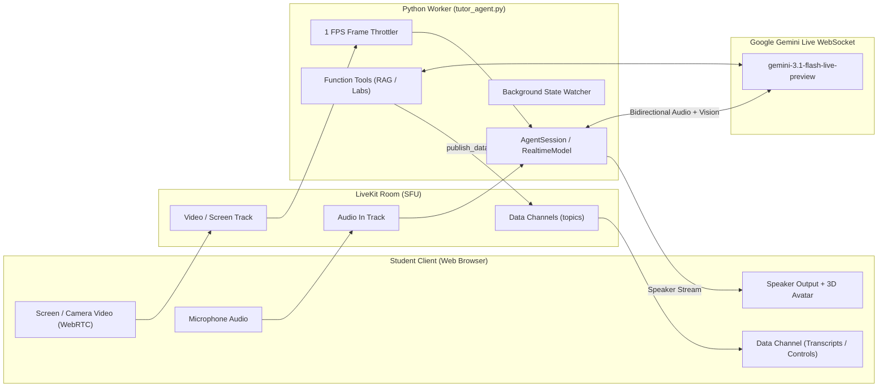

# Gemini Flash Live & LiveKit WebRTC Integration Guide (LIVEDOCS)

This document provides a comprehensive, production-tested reference for building real-time, multimodal voice and vision agents by pairing **Google Gemini Flash Live (`gemini-3.1-flash-live-preview`)** with the **LiveKit WebRTC** infrastructure.

---

## 1. Architectural Philosophy

Traditional voice agents use a cascaded pipeline:
$$\text{WebRTC Audio In} \longrightarrow \text{STT (Deepgram/Whisper)} \longrightarrow \text{LLM (GPT/Claude)} \longrightarrow \text{TTS (ElevenLabs/Cartesia)} \longrightarrow \text{WebRTC Audio Out}$$
This introduces **1.5s – 3.0s+ latency**, mechanical turn-taking, and loses speech inflection, tone, and real-time vision capabilities.

With **Gemini Flash Live + LiveKit**:
1. **End-to-End Native Multimodal Streaming**: Speech-to-speech runs natively over WebSockets inside Gemini's cloud inference. Gemini receives raw PCM audio and video frames directly, and returns raw audio chunks.
2. **Sub-500ms Latency & Natural Turn-Taking**: Gemini handles voice activity detection (VAD), emotion, natural cadence, and interruptions natively in the cloud.
3. **LiveKit WebRTC as the Transport Fabric**: LiveKit acts as the Selective Forwarding Unit (SFU) managing room states, microphone tracks, screen-share/camera video streams, and WebRTC data channels for low-latency frontend synchronization.



---

## 2. Core Dependencies & Critical Patches

### A. Python Environment (`requirements.txt`)
```txt
livekit-agents>=0.8.0
livekit-plugins-google>=0.1.0
livekit-plugins-openai>=0.1.0
lancedb>=0.6.0
python-dotenv>=1.0.0
```

### B. Patch #1: Windows / Edge Hardware Native VAD Bypass
`livekit-agents` defaults to loading C++ inference DLLs (`livekit.local_inference`) for local Silero VAD. Because Gemini Live handles speech detection and turn-taking natively in the cloud, mock this module at the top of your agent script before importing LiveKit:
```python
import sys
from types import ModuleType

class MockVAD:
    def __init__(self, *args, **kwargs): pass
    def predict(self, window): return 0.0

mock_module = ModuleType("livekit.local_inference")
mock_module.EOT_MAX_SAMPLES = 1000
mock_module.VAD_WINDOW_SAMPLES = 512
mock_module.EOT = object
mock_module.VAD = MockVAD
mock_module.init_eot = lambda *args, **kwargs: None
mock_module.init_vad = lambda *args, **kwargs: None
sys.modules["livekit.local_inference"] = mock_module
```

### C. Patch #2: LiveKit Google Realtime Plugin Mutable Context
In `livekit/plugins/google/realtime/realtime_api.py`, the plugin inspects the model name string to decide whether the chat context can be updated dynamically during an ongoing call. Because `gemini-3.1-flash-live-preview` includes `"3.1"`, the default plugin logic can disable mutable chat contexts.
Verify line 296 of `realtime_api.py` in your active Python site-packages is hotpatched to:
```python
mutable = True
```
This enables dynamically pushing updated instructions (e.g., when switching lessons, opening textbooks, or launching screen sharing) into the active session without disconnecting the WebRTC call.

---

## 3. Python Agent Implementation (`tutor_agent.py`)

### A. Worker Entrypoint & Gemini Model Setup
```python
import os
import asyncio
from livekit import agents, rtc
from livekit.agents import AutoSubscribe, JobContext, WorkerOptions, cli, llm
from livekit.agents.voice import AgentSession, Agent, RoomOptions
from livekit.plugins.google.realtime import RealtimeModel

async def entrypoint(ctx: JobContext):
    # 1. Connect to LiveKit Room
    await ctx.connect(auto_subscribe=AutoSubscribe.SUBSCRIBE_ALL)

    # 2. Instantiate Gemini Flash Live Model
    gemini_live = RealtimeModel(
        model="gemini-3.1-flash-live-preview",
        voice="Aoede",  # Options: Aoede, Puck, Charon, Kore, Fenrir
        instructions="You are a Socratic tutor. Guide the student with thoughtful questions.",
        api_key=os.environ["GOOGLE_API_KEY"]
    )

    # 3. Create Session and Voice Agent with Function Tools
    session = AgentSession(
        llm=gemini_live,
        tools=[search_curriculum, control_virtual_lab]
    )
    agent = Agent(
        instructions="You are a Socratic tutor.",
        llm=gemini_live,
        tools=[search_curriculum, control_virtual_lab]
    )

    # 4. Start the Agent Session
    await session.start(agent, room=ctx.room, room_options=RoomOptions(close_on_disconnect=False))

if __name__ == "__main__":
    cli.run_app(WorkerOptions(
        entrypoint_fnc=entrypoint,
        load_threshold=float("inf")  # Prevents CPU load-shedding from dropping dev sessions
    ))
```

---

## 4. Real-Time Vision & Screen Sharing (The 1-FPS Rate Limiter)

When the user shares their screen or camera in the browser, LiveKit publishes a video track to the room.

> **Crucial Optimization**: If you feed a raw 30 FPS video track into Gemini's Realtime WebSocket, you will quickly saturate bandwidth, hit quota limits, and cause buffer overflows. Throttle the frames to **1 frame per second (1 FPS)**:

```python
@ctx.room.on("track_subscribed")
def on_track_subscribed(track: rtc.Track, publication, participant):
    if track.kind == "video":
        logger.info(f"Subscribed to video track from {participant.identity}")
        
        async def forward_video():
            video_stream = rtc.VideoStream(track)
            last_frame_time = 0.0
            try:
                async for event in video_stream:
                    now = asyncio.get_event_loop().time()
                    # Forward at most 1 frame per second to Gemini Live API
                    if now - last_frame_time >= 1.0:
                        last_frame_time = now
                        if hasattr(session, "_activity") and session._activity:
                            session._activity.push_video(event.frame)
            finally:
                await video_stream.aclose()
        
        asyncio.create_task(forward_video())
```

---

## 5. Dynamic Context Hot-Swapping & Proactive Greetings

Real applications change states during a call (navigating from a video lesson to an interactive PDF, taking a quiz, or running a simulation).

Rather than tearing down the WebRTC connection:
1. An async background task monitors state changes (via shared state like `active_session.json` or database flags).
2. The agent rebuilds the system prompt dynamically.
3. It updates the live Gemini session in real-time via `session._activity._rt_session.update(instructions=new_instructions)`.
4. It can trigger an immediate spoken response using `session.generate_reply(user_input=...)`:

```python
async def monitor_session_changes():
    while True:
        await asyncio.sleep(0.5)
        # Detect if user navigated to a new view (e.g., screen share or quiz)
        if view_state_changed:
            new_instructions = rebuild_dynamic_instructions(new_view_state)
            
            # Hot-patch active Gemini session instructions
            if hasattr(session, "_activity") and session._activity._rt_session:
                await session._activity._rt_session.update(instructions=new_instructions)
            
            # Proactively speak without waiting for student to talk first
            session.generate_reply(user_input="Tell the student: 'I see your screen stream now! What would you like to review?'")
```

---

## 6. Bidirectional Function Calling & WebRTC Data Channels

Tools decorated with `@llm.function_tool` perform backend work (e.g., querying LanceDB vector search) and broadcast commands to the frontend across LiveKit WebRTC Data Channels:

```python
@llm.function_tool(description="Control the student's interactive lab simulation.")
async def control_virtual_lab(action: str, value: float = 0.0) -> str:
    cmd_payload = {"action": action, "value": value}
    
    # Send instantly to the browser over LiveKit Data Channel (zero HTTP overhead)
    await ctx.room.local_participant.publish_data(
        payload=json.dumps(cmd_payload).encode("utf-8"),
        topic="lab-control"
    )
    return f"Executed {action} with value {value}."
```

Simultaneously, stream conversation transcripts back to the frontend by listening to conversation events:
```python
@session.on("conversation_item_added")
def on_conversation_item(ev: ConversationItemAddedEvent):
    item = ev.item
    if isinstance(item, llm.ChatMessage):
        payload = json.dumps({
            "type": "chat_message",
            "role": item.role,
            "text": item.text_content
        }).encode("utf-8")
        asyncio.create_task(ctx.room.local_participant.publish_data(payload, topic="tutor-transcripts"))
```

---

## 7. Frontend WebRTC Client (`index.html` / JavaScript)

### A. Connecting & Subscribing to Audio
```javascript
const room = new LivekitClient.Room({
    audioCaptureDefaults: {
        autoGainControl: true,
        echoCancellation: true,
        noiseSuppression: true
    },
    audioPreset: LivekitClient.AudioPresets.speech
});

// Handle incoming audio from Gemini Live
room.on(LivekitClient.RoomEvent.TrackSubscribed, (track, publication, participant) => {
    if (track.kind === LivekitClient.Track.Kind.Audio) {
        const audioElement = track.attach();
        audioElement.play().catch(e => console.warn("Autoplay interaction needed:", e));
    }
});

// Handle Data Channel Messages (Transcripts and Lab Controls)
room.on(LivekitClient.RoomEvent.DataReceived, (payload, participant, kind, topic) => {
    const text = new TextDecoder().decode(payload);
    const data = JSON.parse(text);
    if (topic === "tutor-transcripts") {
        updateChatUI(data.role, data.text);
    } else if (topic === "lab-control") {
        applyPhysicsCommand(data.action, data.value);
    }
});

// Connect to LiveKit SFU and publish microphone
await room.connect(wsUrl, roomToken);
await room.localParticipant.setMicrophoneEnabled(true);
```

### B. Screen Share Publication
```javascript
// Start screensharing into the same LiveKit room
await room.localParticipant.setScreenShareEnabled(true, {
    audio: false,
    resolution: LivekitClient.VideoPresets.h720.resolution
});
```

### C. Browser Autoplay & WebGL Avatar Rule
* **Audio Autoplay**: Always trigger `room.connect()` and `room.startAudio()` inside a user gesture (such as clicking the microphone button) so modern browsers do not block audio output.
* **WebGL Avatar Context**: If your frontend binds audio to an animated 3D avatar (like Three.js or Spatius), moving `<canvas>` elements across DOM nodes (e.g., entering Picture-in-Picture) destroys the WebGL context. Cleanly stop and restart the avatar manager on reparenting.

---

## 8. Resilient Watcher & Auto-Failover (`run_agent.py`)

To handle network drops gracefully (e.g., edge devices or classrooms with intermittent connectivity), wrap the agent process in a supervisor:

```python
# Probes DNS/HTTPS reachability
def check_cloud_connectivity():
    endpoints = [("8.8.8.8", 53), ("generativelanguage.googleapis.com", 443)]
    for host, port in endpoints:
        try:
            s = socket.create_connection((host, port), timeout=1.5)
            s.close()
            return True
        except Exception:
            continue
    return False

# Dynamically spawns online Gemini or local offline fallback (e.g., Gemma 4 + Piper TTS)
if check_cloud_connectivity():
    target_script = "tutor_agent.py"
else:
    target_script = "tutor_agent_offline.py"

subprocess.Popen([sys.executable, target_script])
```

---

## 9. Implementation Checklist

| Component | Target Setting / Implementation |
|---|---|
| **Model** | `gemini-3.1-flash-live-preview` via `livekit.plugins.google.realtime.RealtimeModel` |
| **Plugin Patch** | Ensure `mutable = True` in `realtime_api.py` for dynamic system instructions |
| **Windows VAD** | Mock `livekit.local_inference` to bypass C++ DLL crashes |
| **Vision/Screen Share** | Subscribe to video track and throttle forwarding to **1 FPS** |
| **Prompt Updates** | `await session._activity._rt_session.update(instructions=...)` |
| **Proactive Speech** | `session.generate_reply(user_input=...)` |
| **Data Channels** | `publish_data(payload, topic="...")` for sub-millisecond frontend sync |
| **Client Mic** | `await room.localParticipant.setMicrophoneEnabled(true)` |
