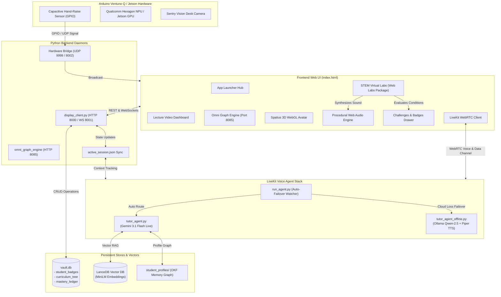

# 🎓 Ventuno AI — Socratic Tutor System (GANDHO)

[](https://www.python.org/)
[](https://livekit.io/)
[](https://deepmind.google/technologies/gemini/)
[]()
[]()
[](https://lancedb.com/)
[]()

> **GANDHO** is an edge-native, multimodal Socratic AI educational appliance built for the **Arduino Ventuno Q** and **NVIDIA Jetson Orin Nano Super** hardware platforms, as well as desktop simulator environments.
>
> Guided by Socratic pedagogical principles, GANDHO acts as a personal mentor—asking probing questions, offering step-by-step hints, evaluating mastery through strict 85%+ gated assessments, observing student work via sentry vision, and physically interacting with virtual science laboratories in real time.

---

## 📑 Table of Contents

- [Architectural Overview](#-architectural-overview)
- [System Modularity & Component Boundaries](#-system-modularity--component-boundaries)
- [Key Features & Capabilities](#-key-features--capabilities)
  - [1. Voice Agent "Lab Telekinesis"](#1-voice-agent-lab-telekinesis)
  - [2. Zero-Asset Procedural Web Audio Engine](#2-zero-asset-procedural-web-audio-engine)
  - [3. Interactive Lab Challenges & Gamified Badges](#3-interactive-lab-challenges--gamified-badges)
  - [4. Dynamic Network Health Watcher & Auto-Failover](#4-dynamic-network-health-watcher--auto-failover)
  - [5. Spatius 3D WebGL Avatar & Document PiP](#5-spatius-3d-webgl-avatar--document-pip)
  - [6. STEM Virtual Labs & Omni Graph Engine](#6-stem-virtual-labs--omni-graph-engine)
- [Target Hardware Specifications](#-target-hardware-specifications)
- [Directory Structure](#-directory-structure)
- [Quick Start Guide](#-quick-start-guide)
- [API Reference](#-api-reference)
- [Technical Documentation](#-technical-documentation)

---

## 🏛️ Architectural Overview



---

## 🧩 System Modularity & Component Boundaries

The Ventuno AI codebase employs a hybrid architecture designed specifically for embedded edge appliances:

| Component | Modularity Level | Implementation | Responsibility |
| :--- | :--- | :--- | :--- |
| **Procedural Audio Engine** | **100% Standalone** | `antigravity_labs/web_labs_package/src/audio/lab_audio.js` | Zero external audio asset dependencies. Synthesizes physical impact thuds, standing wave drones, launches, and victory chimes via the browser's native `AudioContext`. |
| **Lab Challenges & Badges** | **Decoupled Module** | `antigravity_labs/web_labs_package/src/challenges/lab_challenges.js` | Autonomous state machine and XP reward ledger. Mounts into any container via `renderSidebarPanel()` and persists to SQLite via REST. |
| **STEM Virtual Labs Suite** | **Modular ES6 Sub-Package** | `antigravity_labs/web_labs_package/src/` | Domain-segregated into `chemistry/`, `physics/`, `audio/`, and `challenges/`. Lazily loaded into the DOM on demand. |
| **Voice Agent Auto-Failover** | **Process-Level Decoupled** | `livekit_stack/agent/run_agent.py` | Health watcher decoupling online Gemini sessions from local Ollama/Piper sessions with automatic recovery. |
| **Science Backend Solvers** | **Isolated Library / Microservice** | `antigravity_labs/chemistry_backend/` | Dedicated Python solvers isolating RDKit, ChemPy, and SymPy from the web server. |
| **Omni Graph Engine** | **Dedicated Microservice** | `antigravity_labs/omni_graph_engine/` | Independent server on port `8085` executing numerical calculus, Riemann sums, differential slope fields, and 3D surface plots. |
| **Classroom Cockpit Shell** | **Unified Single-File Shell** | `index.html` | Zero-build production shell that runs directly on edge hardware without npm or Webpack overhead. Dynamically lazy-loads modules. |
| **Edge Appliance Gateway** | **Central Dispatcher Hub** | `display_client.py` | Local API coordinator unifying HTTP static delivery, WebSocket broadcasting, UDP hardware signals, and database persistence. |

---

## 🚀 Key Features & Capabilities

### 1. Voice Agent "Lab Telekinesis"
Students can command virtual labs using voice during LiveKit conversations:
- **Speech-to-Lab Actions**: Say *"drop the balls"*, *"set gravity to Moon"*, *"switch to orbital mode"*, or *"pause simulation"*.
- **LiveKit Data Channel**: Publishes JSON payloads across WebRTC topic `"lab-control"` with sub-millisecond local latency.
- **WebSocket Fallback**: Broadcasts via `/api/v1/lab/command` and port `8001` so commands function whether online or offline.
- **Visual Feedback**: Real-time purple Gandho voice feedback toasts render directly on the simulation canvas.

### 2. Zero-Asset Procedural Web Audio Engine
- **100% Offline Procedural Sound**: Synthesizes all sound effects in real time using the browser's native Web Audio API—no MP3 or WAV downloads required.
- **Mass-Velocity Impact Thuds**: Dynamically modulates pitch and gain from kinetic energy: heavy masses produce deep resonant thuds ($40\text{--}70\text{ Hz}$); lighter spheres create crisp clicks ($150\text{--}250\text{ Hz}$).
- **Harmonic Wave Drones**: Generates continuous standing wave tones with dual detuned oscillators filtered through a resonant lowpass filter.
- **Victory Chimes**: Ascending 4-note major triad arpeggios ($\text{C}_5, \text{E}_5, \text{G}_5, \text{C}_6$) celebrate student achievements.

### 3. Interactive Lab Challenges & Gamified Badges
- **Real-Time Condition Tracking**: Curriculum-aligned missions track physics parameters in real time (e.g., Galileo on the Moon, Jupiter High-G, Resonant Harmonics, Artillery Marksman, Low Earth Orbit).
- **Persistent SQLite Ledger**: Rewards are saved to the `student_badges` table in `vault.db` with award timestamps and XP tallies.
- **Interactive UI Panel**: Right-hand mission drawer displays live status indicators, completion criteria, and slide-in celebration toasts.

### 4. Dynamic Network Health Watcher & Auto-Failover
- **Continuous Monitoring**: `run_agent.py` continuously tests cloud reachability to `generativelanguage.googleapis.com:443`.
- **Zero-Downtime Failover**: Automatically switches between:
  - **Online Mode**: `tutor_agent.py` using `gemini-3.1-flash-live-preview` via LiveKit WebRTC with mutable chat contexts.
  - **Offline Mode**: `tutor_agent_offline.py` using local Ollama (Qwen 2.5) + local Piper TTS.
- **Self-Healing**: When internet connectivity returns, gracefully migrates the session back to Gemini online.

### 5. Spatius 3D WebGL Avatar & Document PiP
- **Interactive 3D Avatar**: Real-time lip-synced 3D character powered by the Spatius WebGL engine.
- **Context Preservation**: Cleanly manages WebGL contexts during DOM reparenting between the main workspace and Document Picture-in-Picture (PiP).
- **Synchronized Screen Share**: Automatically synchronizes LiveKit screensharing with browser PiP window events.

### 6. STEM Virtual Labs & Omni Graph Engine
- **Physics Mechanics**: 2D rigid-body Verlet physics, Galileo free fall, elastic collisions, and telemetry HUD vectors.
- **SymPy Wave & Orbital Mechanics**: Exact symbolic derivations for standing waves $y(x,t) = 2A\sin(kx)\cos(\omega t)$, projectile kinematics, and Keplerian orbital velocity $v = \sqrt{GM/r}$.
- **Chemistry Bench**: Chemical reaction simulator with ChemPy stoichiometry, RDKit organic molecule renderer, and PubChem database inspector.
- **Omni Graph Engine (Port 8085)**: Multi-curve plotter, analytical derivative tracing, interactive Riemann sum partitions, ODE slope fields, and 3D parametric surfaces.

---

## 💻 Target Hardware Specifications

| Component | Hardware Specification & Details |
| :--- | :--- |
| **Compute Processor** | Snapdragon SoC with Qualcomm Hexagon NPU (40 TOPS) / NVIDIA Jetson Orin Nano Super |
| **RAM** | 16 GB LPDDR5 RAM (~5 GB for Gemma 4 / Ollama + TTS + LanceDB, leaving 10+ GB free) |
| **Storage** | 128 GB / 256 GB NVMe M.2 2280 SSD mounted at `/data` |
| **Hand-Raise Sensor** | Capacitive Touch Sensor monitored via GPIO in `hardware_bridge.py` |
| **Sentry Vision** | High-speed presence and attention camera running MediaPipe / BlazeFace |
| **Audio Hardware** | MEMS microphone array and stereo speakers configured for low-latency WebRTC |

---

## 📂 Directory Structure

```text
ventuno_ai_testbed/
├── antigravity_labs/                    # Virtual Labs & Science Engine Subsystems
│   ├── chemistry_backend/               # Standalone Python science solvers (RDKit, ChemPy, SymPy)
│   ├── omni_graph_engine/               # Computational calculus & function graphing server (Port 8085)
│   └── web_labs_package/                # Modular client-side Virtual Labs package
│       ├── index.html                   # Standalone labs test harness
│       └── src/
│           ├── audio/lab_audio.js       # 100% offline procedural Web Audio engine
│           ├── challenges/              # Interactive missions, badges & celebration toasts
│           ├── chemistry/               # Chemistry bench, RDKit viewer, PubChem inspector
│           ├── physics/                 # 2D Verlet physics, SymPy wave calculus & orbits
│           └── virtual_labs.js          # Dynamic entry router & catalog matrix
├── livekit_stack/                       # Socratic Voice Agent Architecture
│   ├── agent/
│   │   ├── run_agent.py                 # Dynamic network health watcher & auto-failover
│   │   ├── tutor_agent.py               # Online voice agent (Gemini 3.1 Flash Live + Telekinesis)
│   │   └── tutor_agent_offline.py       # 100% offline voice agent (Ollama + Piper TTS)
│   └── static/                          # LiveKit client WebRTC distributions
├── student_profiles/                    # OKF Student Memory Graph & personalized session states
├── active_session.json                  # Canonical bi-directional runtime session synchronization
├── display_client.py                    # Central edge HTTP (8000), WebSocket (8001) & UDP coordinator
├── hardware_bridge.py                   # Capacitive GPIO sensor bridge
├── index.html                           # Single-page classroom cockpit & Spatius 3D avatar shell
├── orchestrator.py                      # State machine & LanceDB vector RAG search node
├── vault.db                             # Relational SQLite database (curriculum, mastery, badges)
├── DOCS.md                              # Comprehensive technical manual & architectural reference
└── README.md                            # This document
```

---

## ⚡ Quick Start Guide

### 1. Prerequisites
- Python 3.14+ (or Python 3.10+)
- Firefox, Google Chrome, or Microsoft Edge. **Gandho voice works in Firefox on Linux.** Open `http://127.0.0.1:8000/` so the microphone and autoplay are allowed. Chrome/Edge are only required for screen share and some WebGL labs.
- *(Optional for offline mode)*: Local Ollama instance with `qwen2.5` installed and Piper TTS.

### 2. Launch the Edge Server (Windows or Linux)
Start the central HTTP and WebSocket coordinator:
```bash
python display_client.py
```
On Linux, `./boot_linux.sh` waits for `/api/health` and prints the session file path. See the Linux run notes if this tree was checked out without lecture MP4s or `.env` keys.

> The dashboard will be live at `http://localhost:8000/`.

Open **Gandal Space**. Three tabs sit in that pane:

- **Our Space** — home chips, K–12 tracks, one topic, Quiz me, Show graph, Tableau Noir, live voice.
- **Classroom** — OpenMAIC’s classroom player. Type a topic such as “teach me derivatives”, or import a text file. Gandho teaches that lesson in the player: he spotlights the page, points with the laser, and moves the laboratory controls. English and French only. Live voice stays on Our Space.
- **Code** — a Python playground (editor, Run, output, pass/fail tests, hints). It is not a lesson and it is not tied to a topic. Above the editor, write what you are trying to do. Gandho checks that intent against the current Python and says what is right, what is wrong, and how to do it. A mic on this tab turns speech into a question he answers, with the intent and the Python in context. It does not start live voice on Our Space. Python runs in the page with Pyodide. The check uses Gemma 4 E4B at `http://127.0.0.1:8080/v1` (`gemma-4-e4b`) first, then `gemini-3.8-flash` only if that port is down and a real Google key exists. If neither is available, the page says so. English and French only.

The player listens on `http://127.0.0.1:3210` and is started by `gandal_classroom/player/run_player.sh` (Node 22.22 or newer). A local proxy on `127.0.0.1:8099` calls Gemma 4 E4B at `http://127.0.0.1:8080/v1` (`gemma-4-e4b`) first. If that port is down and `GOOGLE_API_KEY` is a real key, it calls `gemini-3.8-flash`. If neither is available, the page says so and Gandho still teaches a classroom built from the topic. The six scene cards appear only when the player process itself cannot start. To run the app in Docker without losing the host model, use host networking (`gandal_classroom/docker-compose.yml`) or set `LOCAL_LLM_URL=http://host.docker.internal:8080/v1`. `./boot_linux.sh` is unchanged.

### 3. Start the Omni Graph Engine (Optional)
To enable the calculus and function graphing module on port 8085:
```bash
python antigravity_labs/omni_graph_engine/server.py 8085
```

### 4. Launch the Socratic Voice Agent
Start the auto-failover voice agent watcher:
```bash
# Development mode with automatic cloud/local failover:
python livekit_stack/agent/run_agent.py dev

# Or force online mode explicitly:
python livekit_stack/agent/run_agent.py --online dev

# Or force 100% offline mode explicitly:
python livekit_stack/agent/run_agent.py --offline dev
```

---

## 📡 API Reference

### Virtual Labs & Telekinesis Endpoints
- `POST /api/v1/lab/command`: Dispatches a voice/UI lab action to all connected clients and updates `active_session.json`.
  ```json
  { "action": "set_gravity", "preset": "moon", "value": 1.6 }
  ```
- `POST /api/v1/badges/award`: Awards a student badge to SQLite `vault.db`.
  ```json
  { "badge_id": "moon_drop", "title": "Galileo on the Moon", "xp": 100 }
  ```
- `GET /api/v1/badges/list`: Returns all earned student badges and timestamps.
- `GET /api/v1/chemistry/database/search?q={query}`: Searches local chemistry structures via RDKit / PubChem.

### Session Synchronization Endpoints
- `GET /get_active_session`: Returns the active lesson, subject track, time seek, and lab state.
- `POST /save_active_session`: Persists the active session state to `active_session.json`.

---

## 📖 Technical Documentation

For complete technical specifications, database schemas, and architectural deep-dives:
- **[System Architecture & Technical Manual (DOCS.md)](DOCS.md)**
- **[Appliance System Context (CONTEXT.md)](CONTEXT.md)**
- **[Design Token Specification (DESIGN.md)](DESIGN.md)**

---

*Ventuno AI Engineering Team — Empowering Socratic Learning Everywhere.*
